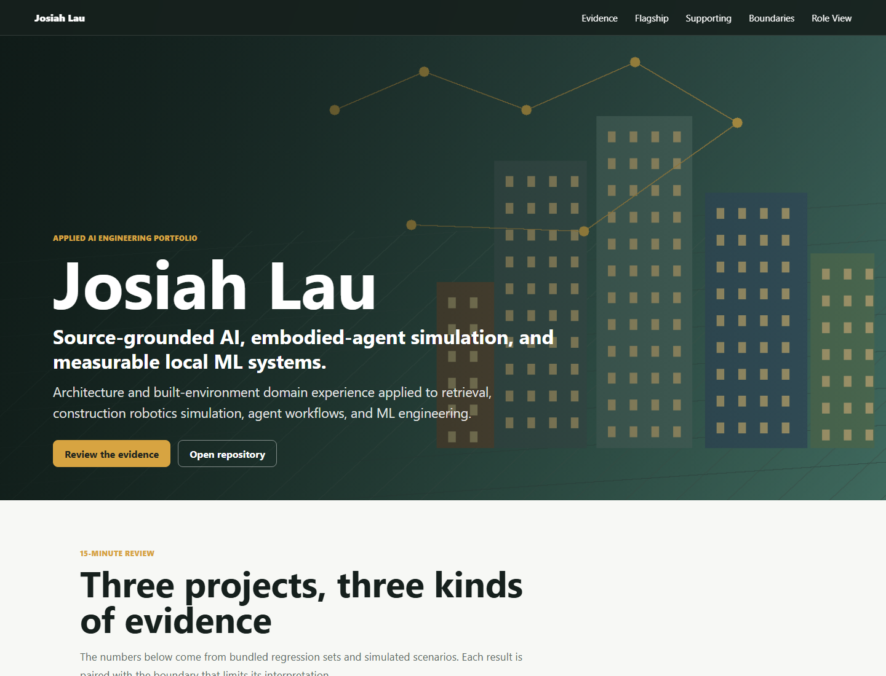

# Josiah Lau | Applied AI Engineering Portfolio

Applied AI engineer focused on source-grounded AI, embodied-agent simulation, and measurable local ML systems, with domain experience in architecture and the built environment.

This repository is designed for technical review: the main projects run without paid APIs, checked-in outputs are labeled by data source, and claims are bounded by tests, evaluations, and explicit limitations.

## Recruiter Fast Path

Start with these three projects. They carry the clearest evidence and represent different parts of the candidate's applied AI profile.

| Priority | Project | Evidence | Current local result | Boundary |
| --- | --- | --- | --- | --- |
| 1 - Flagship | [AEC Code Compliance RAG](projects/aec-code-compliance-rag/README.md) | Public-source ingestion, page-aware chunks, four retrieval modes, citations, abstention, 51-case synthetic regression set, and focused tests. | Hybrid retrieval: `Recall@4 1.000`, `MRR 0.906`, `Hit@3 1.000` on the bundled synthetic eval. | Document-assistance prototype; not compliance certification or professional advice. |
| 2 - Embodied AI | [Construction Embodied Agent Simulator](projects/vla-embodied-agent-simulator/README.md) | Procedural construction grids, expert demonstrations, a fitted behavior-cloning model, disjoint holdout episodes, action filtering, failure analysis, and tests. | Filtered learned policy: `0.625` success with `0.000` unsafe-action rate on 24 unseen scenarios; raw policy succeeds on `0.500`. | Structured 2D simulation; not a foundation VLA, perception stack, ROS integration, or hardware validation. |
| 3 - Model Training | [Local Text Classification Lab](projects/real-model-finetune-lab/README.md) | TF-IDF/logistic-regression fitting, fixed splits, dummy baseline, held-out metrics, confusion matrix, and generated coefficients. | Compact UCI SMS subset: `0.975` accuracy and macro-F1 on a 40-row test split. | Small classical-ML exercise; not pretrained-model fine-tuning or a benchmark claim. |

The metric values above are regression evidence for the included datasets and scenarios. They are not claims of real-world compliance, robot safety, or production model quality.



## Run Evidence Locally

Python 3.11 or newer is recommended.

```bash
python -m pip install -r requirements.txt -r requirements-dev.txt
python projects/aec-code-compliance-rag/scripts/evaluate_retrieval.py
python projects/vla-embodied-agent-simulator/evaluate_vla.py
python projects/real-model-finetune-lab/evaluate_model.py
python -m pytest tests/test_rag.py tests/test_vla_embodied_agent.py tests/test_real_model_finetune_lab.py
```

Full repository verification:

```bash
python scripts/verify.py
```

`scripts/verify.py` regenerates synthetic fixtures and review artifacts, checks repository health, public claims, Markdown links, and the static site, imports every project, enforces artifact idempotence, runs formatting and lint checks, and executes the full pytest suite. Versioned review outputs exclude machine-dependent timestamps and timings so a successful run leaves the tracked tree unchanged.

## Flagship Evidence

### AEC Code Compliance RAG

The flagship converts bundled synthetic guidance or locally downloaded Singapore public documents into metadata-rich chunks, retrieves evidence with TF-IDF, BM25, dense LSA, or hybrid search, and returns citation-bearing answers or an explicit abstention.

- [Architecture](projects/aec-code-compliance-rag/ARCHITECTURE.md)
- [Evaluation design and results](projects/aec-code-compliance-rag/EVAL.md)
- [Generated review outputs](projects/aec-code-compliance-rag/demo_outputs/)
- [Public-source inventory and provenance notes](projects/aec-code-compliance-rag/public_sources/SOURCE_NOTES.md)
- [Focused tests](tests/test_rag.py)
- [Design write-up](docs/AEC_RAG_DESIGN_WRITEUP.md)

Optional Singapore public-source workflow:

```bash
python projects/aec-code-compliance-rag/scripts/download_public_sources.py
python projects/aec-code-compliance-rag/scripts/evaluate_retrieval.py --corpus public
```

The downloader targets official BCA, URA, NEA, SCDF, LTA, PUB, and NParks sources. Downloaded files remain local and are not redistributed. Public retrieval demonstrates provenance-aware ingestion; it does not validate document currency or confer authority approval.


## Supporting Systems

| Project | What is implemented | Honest interpretation |
| --- | --- | --- |
| [Deterministic Research Workflow Assistant](projects/agentic-research-ops-assistant/README.md) | Rule-based planner, permissioned tool registry, local retrieval, citations, retries, approval gates, SQLite traces, and trace evaluation. | Evidence of inspectable tool-workflow engineering, not autonomous research or an adaptive LLM agent. |
| [Local Model Serving and Monitoring Scaffold](projects/mlops-model-serving-monitoring/README.md) | Synthetic churn training, FastAPI schema, generated artifact metadata, SQLite prediction logs, drift calculations, and monitoring reports. | Local operations scaffold, not a deployed platform or real customer system. |

These systems are substantial supporting projects, but the repository does not present them as production deployments.

## Experiments And Baselines

The remaining projects are deliberately tiered below the flagship and supporting systems. They demonstrate narrower workflows, baselines, or interface contracts rather than comparable depth.

[Open the complete project evidence inventory](projects/README.md) for each implementation mode and hard boundary.

<details>
<summary>View experiments and baselines</summary>

- [Construction Progress Metadata Classifier](projects/construction-progress-cv/README.md)
- [BIM Schedule Rule Checker](projects/bim-issue-detection-agent/README.md)
- [AI/AEC Job Description Match Baseline](projects/ai-aec-job-fit-analyzer/README.md)
- [Building Energy Regression Pipeline](projects/building-energy-ml-pipeline/README.md)
- [Spatial Design Scoring Baseline](projects/spatial-design-recommender/README.md)
- [Construction Grid Route Planner](projects/construction-robot-task-planner/README.md)
- [Robot Telemetry Safety Rule Monitor](projects/site-robot-safety-monitor/README.md)
- [Visual QA Provider Contract](projects/multimodal-vlm-visual-qa/README.md)
- [Sequential Decision Simulation Baselines](projects/reinforcement-learning-portfolio/README.md)
- [Vision Baseline / Threshold Model Lab](projects/deep-learning-vision-lab/README.md)
- [Prompt and Output Validation Checks](projects/llm-evals-guardrails-platform/README.md)
- [Content-Based Ranking Baseline](projects/recommender-system-ranking-engine/README.md)
- [Time-Series Forecast and Anomaly Baselines](projects/time-series-anomaly-forecasting/README.md)
- [LoRA Dataset and Configuration Validator](projects/fine-tuning-lora-lab/README.md)

</details>

## Evidence Labels

| Label | Meaning in this repository |
| --- | --- |
| Real local implementation | Runnable and tested code for retrieval, validation, model fitting, persistence, metrics, or simulation. |
| Public-source subset | Public data or documents with source notes; still limited in size and review scope. |
| Synthetic data | Generated demo data containing no customer, employer, private-project, or confidential content. |
| Mock provider | Deterministic LLM/VLM substitute used to test workflow contracts without paid services. |
| Simulation | Locally evaluated environment behavior, including a small learned action policy; no physical robot or real-world safety claim. |
| Generated artifact | Reproducible output from an evaluation command. Runtime model binaries and databases are ignored by Git. |

## Repository Map

```text
projects/                 project code, project-level evidence, and limitations
tests/                    cross-project and focused regression tests
scripts/                  setup, verification, claim, site, and artifact checks
docs/                     reviewer guides, design notes, and portfolio-wide boundaries
portfolio-site/           static evidence-first portfolio view
shared/                   small reusable local AI utilities
```

## Reviewer Guides

- [Five- and fifteen-minute review paths](docs/how-to-review-this-portfolio.md)
- [Technical review guide](docs/technical-review-guide.md)
- [Role-specific reviewer guide](docs/REVIEWER_GUIDE.md)
- [Scope and limitations](docs/SCOPE_AND_LIMITATIONS.md)
- [Claims policy](docs/CLAIMS_POLICY.md)
- [Authenticity and ownership](docs/AUTHENTICITY_AND_OWNERSHIP.md)

## Static Portfolio

```bash
python -m http.server 8080 --directory portfolio-site
```

Then open `http://localhost:8080`.

## Contact

- [GitHub](https://github.com/josiahsutd-stack)
- [LinkedIn](https://www.linkedin.com/in/josiah-lau-8041822b6/)
- Email is available in application materials.
