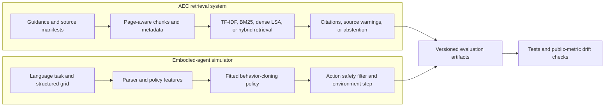
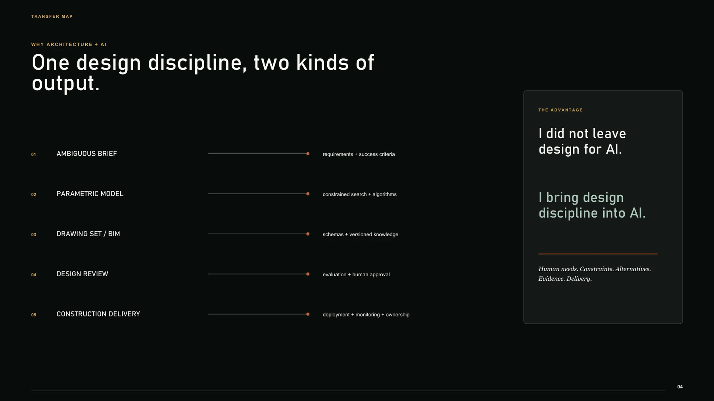

# Josiah Lau | Applied AI Engineer

I work on retrieval systems, embodied-agent simulation, and evaluated machine-learning workflows. My background in architecture brings a built-environment perspective to the projects in this portfolio.

The core demos run locally without paid APIs. Each selected project includes tests, saved evaluation results, data-source notes, and documented limitations.

## Selected Work

These three projects best represent my current work in retrieval, embodied AI, and model development.

| Project | Focus | Evidence | Current result | Limits |
| --- | --- | --- | --- | --- |
| [AEC Code Compliance RAG](projects/aec-code-compliance-rag/README.md) | Retrieval and document intelligence | Public-source ingestion, page-aware chunks, four retrieval modes, citations, abstention, a 51-case synthetic regression set, and focused tests. | Hybrid retrieval: `Recall@4 1.000`, `MRR 0.906`, and `Hit@3 1.000` on the bundled synthetic evaluation. | Document-assistance prototype; not compliance certification or professional advice. |
| [Construction Embodied Agent Simulator](projects/vla-embodied-agent-simulator/README.md) | Embodied AI | Procedural construction grids, expert demonstrations, a fitted behavior-cloning model, disjoint holdout episodes, action filtering, failure analysis, and tests. | Filtered learned policy: `0.625` success with a `0.000` unsafe-action rate on 24 unseen scenarios; raw policy success is `0.500`. | Structured 2D simulation; no foundation VLA, perception stack, ROS integration, or hardware validation. |
| [Local Text Classification Lab](projects/real-model-finetune-lab/README.md) | Supervised model development | TF-IDF and logistic-regression fitting, deterministic source-traceable splits, a dummy baseline, held-out metrics, a confusion matrix, and generated coefficients. | Compact UCI SMS subset: `0.950` accuracy and macro-F1 on a 40-row test split. | Small classical-ML exercise; not pretrained-model fine-tuning or a benchmark claim. |

These numbers come from the bundled evaluation datasets and simulator scenarios. They do not measure real-world compliance, robot safety, or production performance.

[Evidence ledger: JSON artifacts and commands behind each result.](docs/EVIDENCE_LEDGER.md)


*Generated portfolio concept image. It illustrates the domain focus; it is not project, customer, deployment, or hardware evidence.*

## System Overview



## Run Locally

Python 3.11 or newer is recommended.

```bash
python -m pip install -r requirements.txt -r requirements-dev.txt
python projects/aec-code-compliance-rag/scripts/evaluate_retrieval.py
python projects/vla-embodied-agent-simulator/evaluate_vla.py
python projects/real-model-finetune-lab/evaluate_model.py
python -m pytest tests/test_rag.py tests/test_vla_embodied_agent.py tests/test_real_model_finetune_lab.py
```

Full repository verification:

```bash
python scripts/verify.py
```

`scripts/verify.py` regenerates synthetic fixtures and evidence artifacts, checks repository health, public claims, Markdown links, and the static site, imports every project, enforces artifact idempotence, runs formatting and lint checks, and executes the full pytest suite. Versioned outputs exclude machine-dependent timestamps and timings so a successful run leaves the tracked tree unchanged.

## Flagship Project

### AEC Code Compliance RAG

The flagship converts bundled synthetic guidance or locally downloaded Singapore public documents into metadata-rich chunks, retrieves evidence with TF-IDF, BM25, dense LSA, or hybrid search, and returns citation-bearing answers or an explicit abstention.

- [Architecture](projects/aec-code-compliance-rag/ARCHITECTURE.md)
- [Evaluation design and results](projects/aec-code-compliance-rag/EVAL.md)
- [Generated evaluation outputs](projects/aec-code-compliance-rag/demo_outputs/)
- [Public-source inventory and provenance notes](projects/aec-code-compliance-rag/public_sources/SOURCE_NOTES.md)
- [Focused tests](tests/test_rag.py)
- [Design write-up](docs/AEC_RAG_DESIGN_WRITEUP.md)

Optional Singapore public-source workflow:

```bash
python projects/aec-code-compliance-rag/scripts/download_public_sources.py
python projects/aec-code-compliance-rag/scripts/evaluate_retrieval.py --corpus public
```

The downloader targets official BCA, URA, NEA, SCDF, LTA, PUB, and NParks sources. Downloaded files remain local and are not redistributed. Public retrieval demonstrates provenance-aware ingestion; it does not validate document currency or confer authority approval.


## Embodied AI Project

### Construction Embodied Agent Simulator

The embodied-agent project converts a language task and structured construction grid into closed-loop actions. It compares a deterministic A* reference with a fitted random-forest behavior-cloning policy, reports raw failures, and measures the same learned policy with an explicit action filter.


*Generated concept image, not a simulator screenshot or hardware claim. The [project README](projects/vla-embodied-agent-simulator/README.md), [evaluation report](projects/vla-embodied-agent-simulator/EVAL.md), and [local screenshot](docs/assets/screenshots/embodied-agent-demo.png) contain the implementation evidence.*

## Supporting Systems

| Project | What is implemented | Honest interpretation |
| --- | --- | --- |
| [Deterministic Research Workflow Assistant](projects/agentic-research-ops-assistant/README.md) | Rule-based planner, permissioned tool registry, local retrieval, citations, retries, approval gates, SQLite traces, and trace evaluation. | Evidence of inspectable tool-workflow engineering, not autonomous research or an adaptive LLM agent. |
| [Local Model Serving and Monitoring Scaffold](projects/mlops-model-serving-monitoring/README.md) | Synthetic churn training, FastAPI schema, generated artifact metadata, SQLite prediction logs, drift calculations, and monitoring reports. | Local operations scaffold, not a deployed platform or real customer system. |

These systems are substantial supporting projects, but the repository does not present them as production deployments.

## Architecture Background

Architecture is the domain context for the AEC and embodied-AI projects, not a substitute for engineering evidence. The transfer map below shows how design practices inform requirements, data structures, evaluation, human review, and delivery.



[Selected architecture work and image provenance](docs/ARCHITECTURE_BACKGROUND.md)

## Experiments And Baselines

Narrow baselines and interface contracts are kept under [`experiments/`](experiments/README.md), outside the selected project tree. They remain runnable and tested, but they do not support the portfolio's headline claims.

## Evidence Labels

| Label | Meaning in this repository |
| --- | --- |
| Real local implementation | Runnable and tested code for retrieval, validation, model fitting, persistence, metrics, or simulation. |
| Public-source subset | Public data or documents with source notes; still limited in size and review scope. |
| Synthetic data | Generated demo data containing no customer, employer, private-project, or confidential content. |
| Mock provider | Deterministic LLM/VLM substitute used to test workflow contracts without paid services. |
| Simulation | Locally evaluated environment behavior, including a small learned action policy; no physical robot or real-world safety claim. |
| Generated artifact | Reproducible output from an evaluation command. Runtime model binaries and databases are ignored by Git. |

## Repository Map

```text
projects/                 five selected projects and their evidence
experiments/              narrow baselines and interface-contract studies
tests/                    cross-project and focused regression tests
scripts/                  setup, verification, claim, site, and artifact checks
docs/                     reviewer guides, design notes, and portfolio-wide boundaries
portfolio-site/           static evidence-first portfolio view
shared/                   small reusable local AI utilities
```

## Reviewer Guides

- [Five- and fifteen-minute review paths](docs/how-to-review-this-portfolio.md)
- [Technical review guide](docs/technical-review-guide.md)
- [Role-specific reviewer guide](docs/REVIEWER_GUIDE.md)
- [Scope and limitations](docs/SCOPE_AND_LIMITATIONS.md)
- [Claims policy](docs/CLAIMS_POLICY.md)
- [Authenticity and ownership](docs/AUTHENTICITY_AND_OWNERSHIP.md)

## Static Portfolio

```bash
python -m http.server 8080 --directory portfolio-site
```

Then open `http://localhost:8080`.


## Contact

- [GitHub](https://github.com/josiahsutd-stack)
- [LinkedIn](https://www.linkedin.com/in/josiah-lau-8041822b6/)
- Email is available in application materials.
