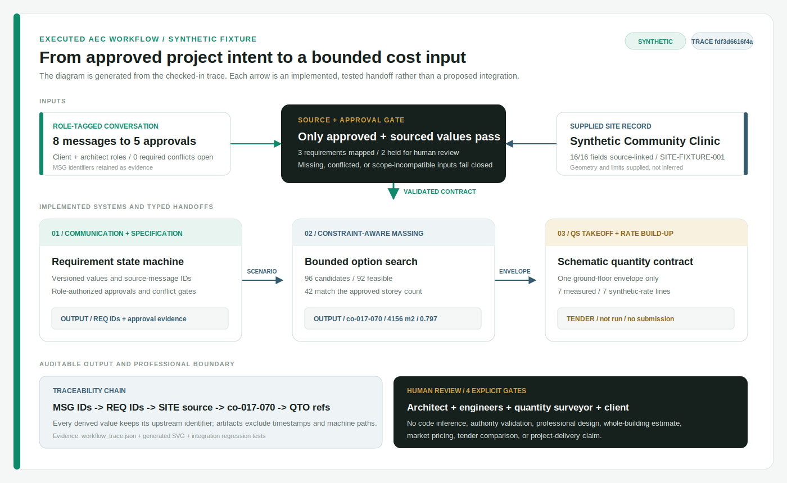
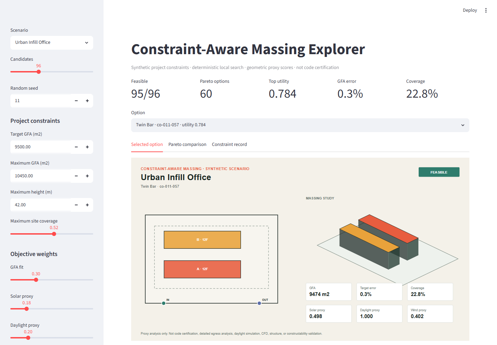
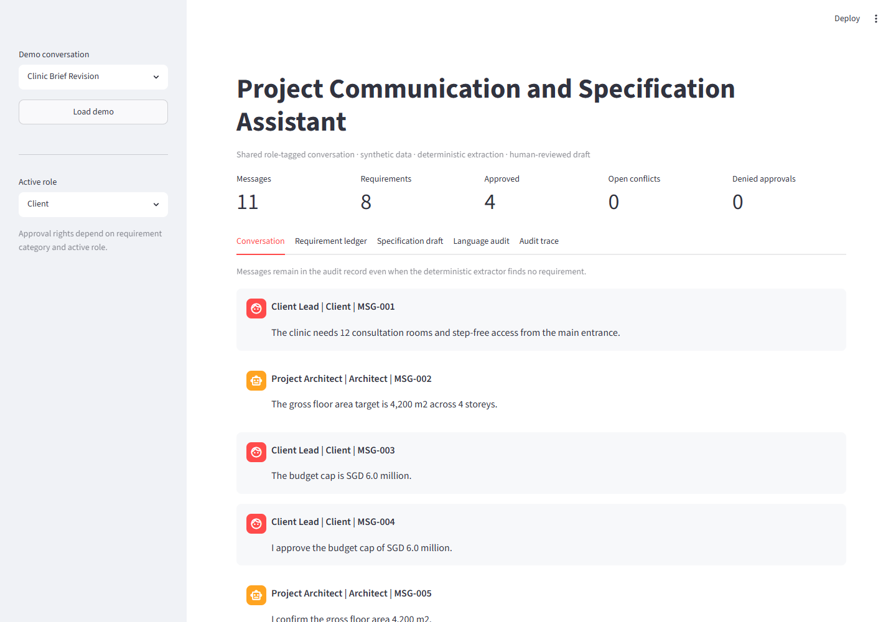
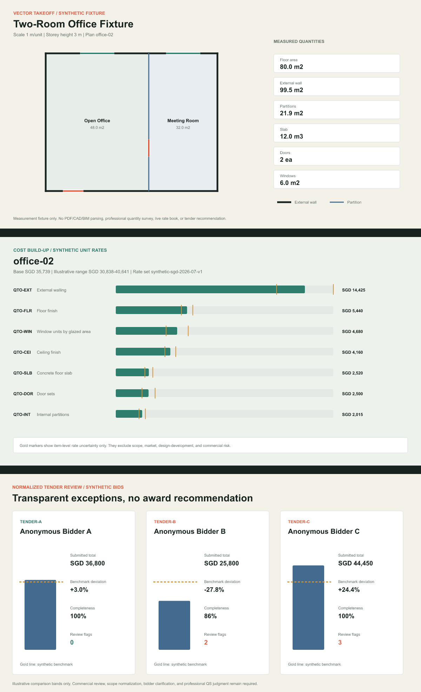
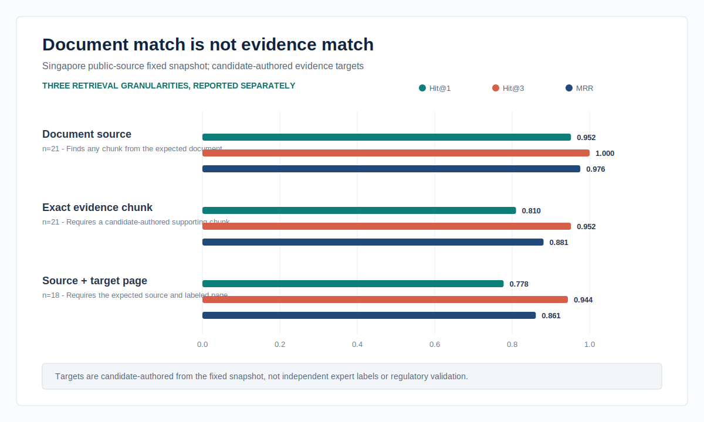
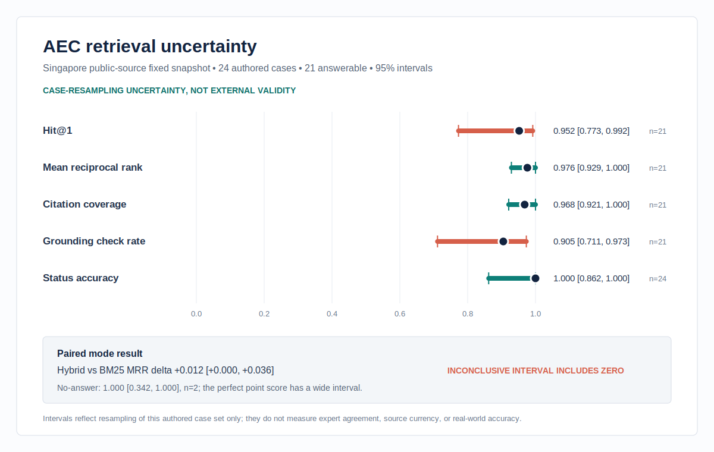
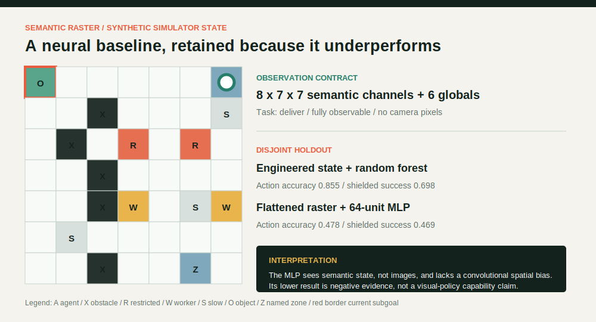
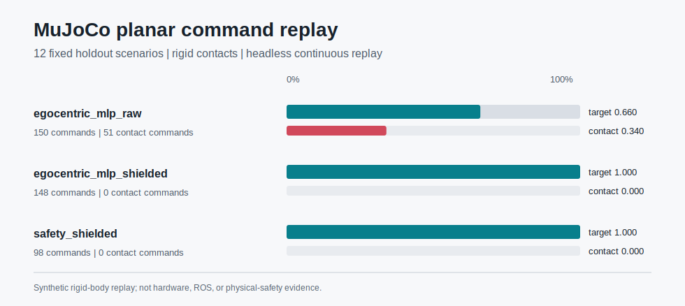

# Josiah Lau | Applied AI Engineer

I build evaluated AI systems for design and construction decisions. My background in architecture informs the domain models, constraints, review gates, and visual communication in this portfolio; the engineering evidence comes from runnable code, tests, evaluation datasets, and reproducible outputs.

The selected projects form one technical journey: source-grounded AEC knowledge, approved project requirements, constrained design options, traceable quantities, and embodied-agent simulation. Every project runs locally without paid APIs and labels synthetic, public-source, simulated, and generated evidence explicitly.

## Selected Work

These three projects carry the clearest technical and domain evidence.

| Project | What it demonstrates | Evidence in plain language | Honest boundary |
| --- | --- | --- | --- |
| [AEC Code Compliance RAG](projects/aec-code-compliance-rag/README.md) | Page-aware public-document ingestion, four inspectable retrieval modes, citations, abstention, evaluation, and a tested local service. | The expected document is usually found first, but exact supporting-passage retrieval is weaker. That gap is measured and published rather than hidden. | Document assistance only; not compliance certification, legal advice, deployment, uptime, or proof that public documents are current. |
| [Construction Embodied Agent Simulator](projects/vla-embodied-agent-simulator/README.md) | Shared demonstrations, state and rendered-pixel observations, appearance-shift evaluation, closed-loop imitation, action filtering, and planar MuJoCo replay. | The local-state policy completes more held-out tasks after filtering; an unseen colour palette sharply degrades the pixel policy, and the failed result remains visible. | Pixels are rendered from simulator state and the filter sees full rules; no physical camera, mobile robot, ROS, hardware, or physical-safety validation. |
| [Constraint-Aware Massing Explorer](projects/constraint-aware-massing-explorer/README.md) | Parametric geometry, hard constraints, Pareto ranking, editable objectives, and transparent environmental and access proxies. | Constraint-aware generation produces far more valid options and much closer target-area fit than the equal-sized unconstrained baseline. | Rectangular proxy model; no code inference, internal egress, calibrated daylight/CFD, structure, or approvable design. |

### Reproduce The Core Evidence

```bash
python scripts/reviewer_check.py
```

This non-mutating check validates public claims, documentation commands, links, the static site, every advertised app title, and focused tests for the flagship, embodied, massing, and integration paths. The [evidence ledger](docs/EVIDENCE_LEDGER.md) maps each headline measurement to its versioned JSON artifact and reproduction command.

<details>
<summary><strong>Flagship retrieval statistics and label provenance</strong></summary>

Public 24-case snapshot over 15 validated documents: `Hit@1 0.952`, `MRR 0.976`, paraphrase `MRR 0.917`, and no-answer accuracy `1.000`. Fixed local workload: 48/48 responses returned 200, zero server errors, and P95 at or below 500 ms.

The practical finding is that document discovery is stronger than evidence localization. A correct publication does not count as a correct supporting passage unless the candidate-authored chunk or page target is retrieved.

Candidate-authored exact-target check: Hit@1 `0.810`, Hit@3 `0.952`, and MRR `0.881` across `21` labeled answerable cases; source-page Hit@1 `0.778` and MRR `0.861` across `18` page-labeled cases. Exact-target uncertainty: Hit@1 `0.810` has a 95% interval of `[0.600, 0.923]`, and exact-target MRR `0.881` has a 95% interval of `[0.762, 0.976]` across `21` candidate-authored targets.

Uncertainty check: public Hit@1 `0.952` has a 95% Wilson interval of `[0.773, 0.992]` over `21` answerable cases; MRR `0.976` has a 95% bootstrap interval of `[0.929, 1.000]`; no-answer `1.000` is `2/2` with a Wilson interval of `[0.342, 1.000]`. Hybrid versus BM25 MRR delta is `0.012` with a 95% paired interval of `[0.000, 0.036]`; the interval includes zero, so mode superiority is inconclusive on this authored set.

</details>

<details>
<summary><strong>Embodied and massing measured results</strong></summary>

On 96 unseen grids, egocentric filtered success is `0.760`; rendered-RGB success is `0.719` normally and `0.427` under an unseen palette, which requires 3315 interventions. On a balanced 12-scenario physics subset, raw egocentric commands contact rigid geometry 51/150 times; filtered commands record 0/148 contacts.

Across 864 candidates per method: feasible rate `0.977` versus `0.052` for the unconstrained baseline; mean best GFA error `0.19%` versus `34.47%`.

</details>

## System Overview

The selected AEC projects are independently runnable. A separate [executable integration contract](integrations/aec-design-to-cost/README.md) proves one bounded handoff across the specification, massing, and QS interfaces.

[](integrations/aec-design-to-cost/demo_outputs/workflow_trace.svg)

- **Two input streams:** approved role-tagged requirements and an explicit synthetic site record.
- **Fail-closed gates:** only approved, source-linked, conflict-free, scope-compatible values cross project boundaries.
- **Three implemented systems:** requirement state, constraint-aware massing, and vector takeoff with synthetic rate provenance.
- **Traceable handoff:** message IDs, requirement IDs, site-source IDs, candidate ID, and quantity references survive into the checked-in trace.
- **Professional boundary:** budget and accessibility remain for human review; tender analysis is not run.

Synthetic workflow fixture: `5` approved requirements (`3` mapped, `2` retained), `16/16` sourced scenario fields, `96` candidates (`92` feasible, `42` storey-matched), and `7` priced takeoff lines; tender stage `not_run`.

The integration deliberately retains budget and accessibility for human review, does not infer building-code or site facts, treats mass footprints only as a schematic one-storey QS input, and does not compare its bounded cost output with the full-project budget.



Two supporting projects complete that workflow:

| Project | Implemented evidence | Current result | Boundary |
| --- | --- | --- | --- |
| [Project Communication and Specification Assistant](projects/project-specification-copilot/README.md) | Shared role-tagged chat, requirement versions, conflict detection, approval scopes, SQLite audit events, source ids, and draft clauses. | All authored workflow checks pass across 5 synthetic conversations and 35 messages; a separate 33-case language stress set records F1 `0.958`, exact-case accuracy `0.939`, negative-control accuracy `1.000`, and 2 retained number-word misses. | Candidate-authored deterministic language checks; not open-domain understanding, a multi-user messaging service, or a professional specification. |
| [QS Takeoff and Tender Analysis Workbench](projects/qs-takeoff-tender-analysis/README.md) | Shared-wall geometry, opening deductions, quantity formulas, rate provenance, uncertainty bands, and line-level tender exceptions. | 21/21 authored quantities and all 5 tender exceptions reproduced; naive perimeter baseline wall MAE `6.333 m`, implemented estimator `0.000 m`. | Synthetic vector plans, rates, and tenders; no PDF/CAD/BIM parsing, market pricing, professional QS output, or award recommendation. |





## Run Locally

Python 3.11 or newer is recommended.

```bash
python -m pip install -r requirements.txt -r requirements-dev.txt
python projects/aec-code-compliance-rag/scripts/evaluate_retrieval.py
python projects/aec-code-compliance-rag/evaluate_service.py
python projects/aec-code-compliance-rag/evaluate_service_reliability.py
python projects/vla-embodied-agent-simulator/evaluate_vla.py
python projects/constraint-aware-massing-explorer/evaluate_massing.py
python projects/project-specification-copilot/evaluate_specification.py
python projects/qs-takeoff-tender-analysis/evaluate_qs.py
python integrations/aec-design-to-cost/run_workflow.py
python -m pytest tests/test_rag.py tests/test_rag_service.py tests/test_vla_embodied_agent.py tests/test_massing_explorer.py tests/test_project_specification_copilot.py tests/test_qs_takeoff_tender_analysis.py tests/test_aec_workflow_integration.py
```

Full repository verification:

```bash
python scripts/verify.py
```

`scripts/verify.py` regenerates synthetic fixtures and evidence artifacts, checks repository health, public claims, Markdown links, and the static site, imports every project, enforces artifact idempotence, runs formatting and lint checks, and executes the full pytest suite. Successful verification leaves the tracked tree unchanged.

## Flagship Project

### AEC Code Compliance RAG

The flagship converts bundled synthetic guidance or locally downloaded Singapore public documents into metadata-rich chunks, retrieves evidence with TF-IDF, BM25, dense LSA, or hybrid search, and returns citation-bearing answers or an explicit abstention. Its local FastAPI boundary adds fail-closed API-key configuration, bounded request IDs, readiness checks, redacted SQLite query logs, process counters, bounded payload-free durable telemetry, and query latency/error objectives.

The checked-in in-process service evaluation records 12/12 contract checks passed and 9 requests observed before the metrics response. This is interface evidence, not external deployment or user-traffic evidence.

A separate fixed in-process workload records 14/14 reliability checks passed: 48/48 responses returned 200, zero server errors, P95 at or below 500 ms, and 48 durable query rows remained after app reconstruction. Exact wall-clock latency is runtime-only because it varies by machine; this is not sustained-load, network, uptime, or capacity evidence.

The public retrieval artifact also reports deterministic Wilson and fixed-seed bootstrap intervals plus paired mode deltas. The intervals measure sensitivity to resampling the same 24 authored cases; they do not establish independent labels, document currency, or performance on a broader query population.

- [Architecture](projects/aec-code-compliance-rag/ARCHITECTURE.md)
- [Evaluation design and results](projects/aec-code-compliance-rag/EVAL.md)
- [Generated evaluation outputs](projects/aec-code-compliance-rag/demo_outputs/)
- [Public uncertainty report](projects/aec-code-compliance-rag/demo_outputs/public_sources/retrieval_uncertainty_report.md)
- [Evidence-target label audit](projects/aec-code-compliance-rag/demo_outputs/public_sources/target_label_report.md)
- [Local service contract report](projects/aec-code-compliance-rag/demo_outputs/service_contract_report.md)
- [Local reliability report](projects/aec-code-compliance-rag/demo_outputs/service_reliability_report.md)
- [Public-source inventory and provenance](projects/aec-code-compliance-rag/public_sources/SOURCE_NOTES.md)
- [Focused retrieval tests](tests/test_rag.py) and [service tests](tests/test_rag_service.py)
- [Design write-up](docs/AEC_RAG_DESIGN_WRITEUP.md)

Optional Singapore public-source workflow:

```bash
python projects/aec-code-compliance-rag/scripts/download_public_sources.py
python projects/aec-code-compliance-rag/scripts/evaluate_retrieval.py --corpus public
```

The downloader targets official BCA, URA, NEA, SCDF, LTA, PUB, and NParks sources. It rejects HTML or error payloads masquerading as PDFs and records resolved URLs plus SHA-256 fingerprints. Downloaded files remain local and are not redistributed.




*A correct source document does not count as an exact evidence hit unless a candidate-authored target chunk is retrieved. The labels come from the fixed local snapshot and have not been independently reviewed.*



*Generated from the fingerprinted 24-case public snapshot. Wide intervals expose small-sample limits; they are not external-validity or professional-accuracy claims.*

## Embodied AI Project

### Construction Embodied Agent Simulator

The simulator converts a language task and structured construction grid into closed-loop actions. Four learned policy families share 192 training scenarios and a 96-scenario disjoint holdout: a random forest over 24 engineered features, MLPs over a flattened 398-value world raster and 210 agent-centered local-state values, and an MLP over a rendered 10x10 RGB crop plus ten task values. Mean-pixel ablation lowers RGB action accuracy from `0.813` to `0.474`; an unseen work-light palette then drives raw completion from `0.635` to `0.000`. A separate headless MuJoCo adapter replays a balanced 12-scenario command subset: raw egocentric movement contacts rigid geometry on 51 of 150 commands, while the filtered trace records zero contacts across 148 commands.



*Generated from the evaluator's actual holdout metrics and rendered pixel inputs. RGB values originate from privileged simulator state, not a physical camera. Local classifiers hide off-window hazards; their filters do not.*



*Generated from the fixed MuJoCo replay artifact. The body has two planar slide joints and static collision proxies; this is command-boundary regression evidence, not a mobile-robot, ROS, or physical-safety result.*


*Generated concept image, not a simulator screenshot or hardware claim. The [project README](projects/vla-embodied-agent-simulator/README.md), [evaluation report](projects/vla-embodied-agent-simulator/EVAL.md), and [local screenshot](docs/assets/screenshots/embodied-agent-demo.png) contain the implementation evidence.*

## Architecture Background

Architecture is the domain context for the AEC and embodied-AI projects, not a substitute for engineering evidence. The transfer map shows how design practices inform requirements, spatial constraints, evaluation, human review, and delivery.


[Selected architecture work and image provenance](docs/ARCHITECTURE_BACKGROUND.md)

## Experiments And Baselines

Eight focused AEC and AI engineering studies remain under [`experiments/`](experiments/README.md), outside the selected project set. The retained experiments prioritize implementation evidence over project count; they remain runnable and tested but do not support the first-screen claims.

## Evidence Labels

| Label | Meaning in this repository |
| --- | --- |
| Real local implementation | Runnable and tested code for retrieval, validation, geometry, model fitting, persistence, metrics, or simulation. |
| Public-source subset | Public documents or data with source notes; still limited in size, date, and expert-review scope. |
| Synthetic data | Authored or generated demo data containing no customer, employer, private-project, bidder, or confidential content. |
| Mock provider | Deterministic LLM/VLM substitute used to test workflow contracts without paid services. |
| Simulation | Locally evaluated environment behavior; no physical robot or real-world safety claim. |
| Generated artifact | Reproducible output from an evaluation command; timestamps and machine-specific paths are excluded. |

## Repository Map

```text
projects/                 five selected AEC and embodied-AI projects
integrations/             tested contracts between selected project interfaces
experiments/              eight focused baselines and workflow studies
tests/                    focused and cross-project regression tests
scripts/                  setup, verification, claim, site, and artifact checks
docs/                     reviewer guides, design notes, provenance, and boundaries
portfolio-site/           static evidence-first portfolio view
shared/                   small reusable local AI utilities
```

## Technical Review

- [Five- and fifteen-minute evidence paths](docs/how-to-review-this-portfolio.md)
- [Technical review guide](docs/technical-review-guide.md)
- [Role-to-project map](docs/role-to-project-map.md)
- [Scope and limitations](docs/SCOPE_AND_LIMITATIONS.md)
- [System maps and visual evidence](docs/architecture-diagrams.md)
- [Claims policy](docs/CLAIMS_POLICY.md)
- [Engineering decisions and evidence boundaries](docs/ENGINEERING_DECISIONS.md)
- [Engineering review log](ENGINEERING_REVIEW_LOG.md)
- [Evidence coverage audit](EVIDENCE_COVERAGE_AUDIT.md)

## Static Portfolio

```bash
python -m http.server 8080 --directory portfolio-site
```

Then open `http://localhost:8080`.

The static site uses the same generated massing, specification, QS, retrieval, and embodied-agent evidence shown in the project documentation.

## Contact

- [GitHub](https://github.com/josiahsutd-stack)
- [LinkedIn](https://www.linkedin.com/in/josiah-lau-8041822b6/)
- Email is available in application materials.
