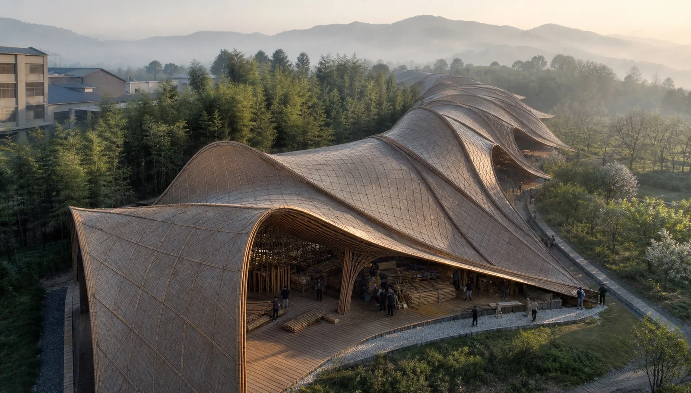
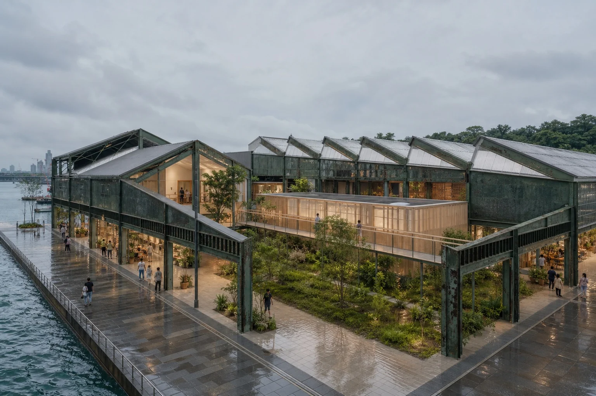
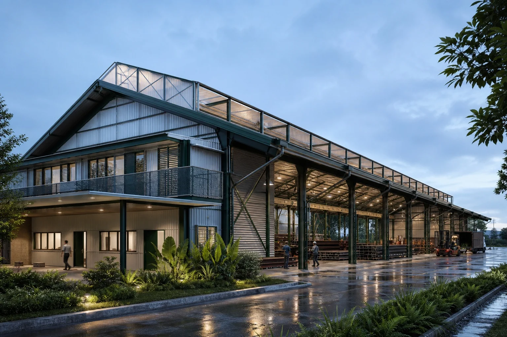

# Architecture Background

My architecture work provides the domain context for the AEC retrieval and embodied-AI projects in this repository. It does not replace software tests, model evaluation, or robotics validation.

## Transfer To AI Engineering

The transfer is methodological: ambiguous briefs become requirements and success criteria; parametric models become constrained search; drawing sets and BIM become schemas and versioned knowledge; design review becomes evaluation with human approval; construction delivery becomes monitoring and ownership. These parallels do not imply that architectural delivery and AI deployment are equivalent disciplines.

## Selected Architecture Work

### Bamboo Factory Of The Future

**Status:** 2019 M.Arch thesis in Baizhang, China. The image is an AI-assisted visualization anchored to the original project drawings; the work is academic and is not presented as a built project or construction documentation.

The project used site, production flow, material behavior, and parametric variation to organize a factory and visitor route. Its relevance here is the explicit progression from constraints to variants, review, and component logic.

### Tideline Commons

**Status:** self-initiated 2026 adaptive-reuse concept using a generic Singapore waterfront context. It was not commissioned or built.

The study compares reversible interventions within a retained industrial frame. The portfolio workflow records assumptions and option criteria before selection; dimensions, code, engineering, and site conditions would require project-specific verification.

### Monsoon Works

**Status:** self-initiated configurable steel-hall concept. It is not a commissioned building, structural design, or fabrication package.

The project treats grid, climate, operational flow, and assembly as explicit parameters. Structural calculations, fire design, corrosion protection, logistics, and fabrication decisions would require qualified specialists.

## Image Provenance

The transfer map and three project images are selected from *Josiah Lau - Architecture + AI Portfolio 2026*, supplied by the portfolio owner. The project images retain the status and AI-assistance labels used in that document. The generated robot images elsewhere in this repository are labeled as concept imagery and are not presented as deployed-system evidence.
