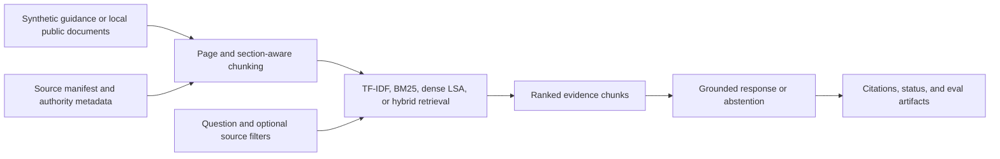
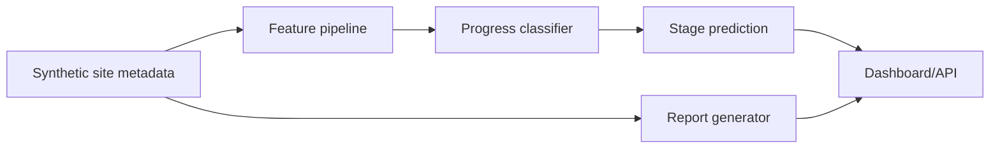
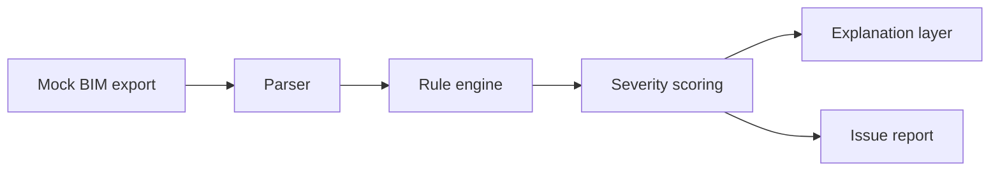
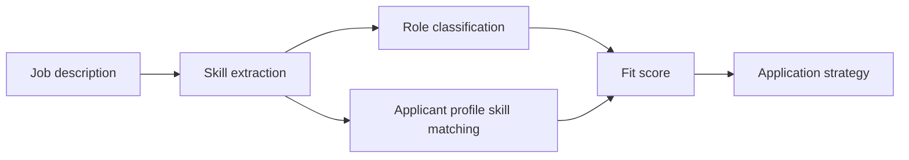
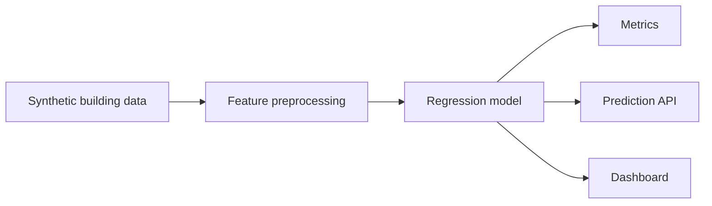
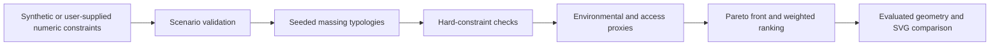
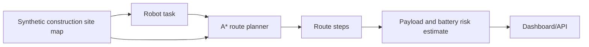
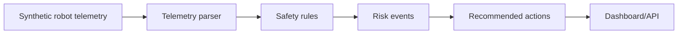

# Architecture Diagrams

## AEC Code Compliance RAG Assistant

## Construction Progress Metadata Classifier

## BIM Schedule Rule Checker

## AI/AEC Job Description Match Baseline

## Building Energy Regression Pipeline

## Constraint-Aware Massing Explorer

## Construction Grid Route Planner

## Robot Telemetry Safety Rule Monitor

