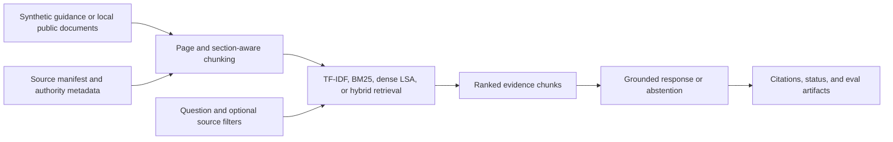
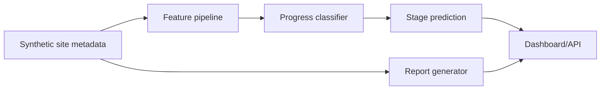
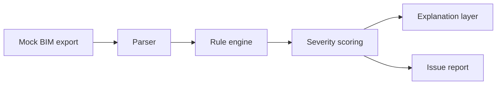
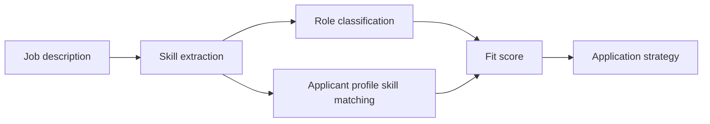
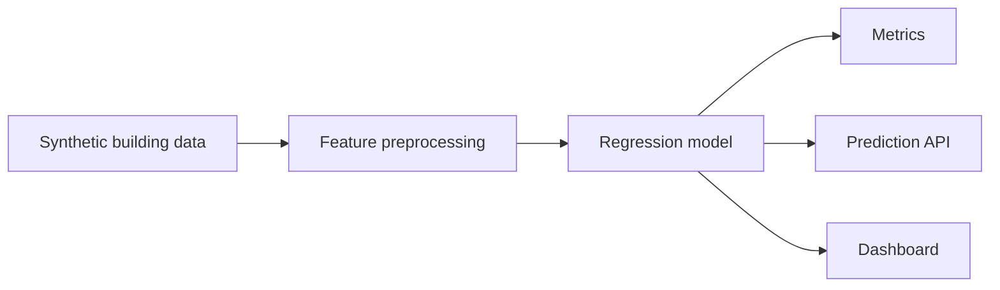
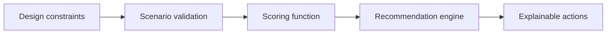
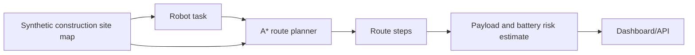
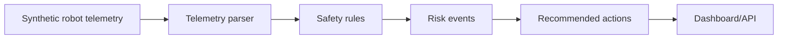

# Architecture Diagrams

## AEC Code Compliance RAG Assistant

## Construction Progress CV Workflow Tracker

## BIM Issue Detection Agent

## AI + AEC Job Fit Analyzer

## Building Energy ML Pipeline

## Spatial Design Recommender

## Construction Robot Task Planner

## Site Robot Safety Monitor

