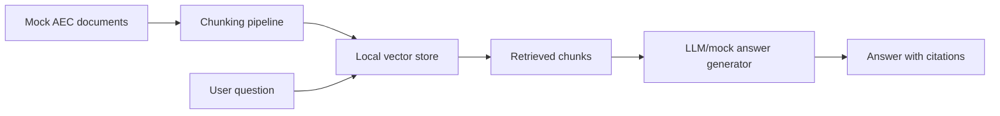
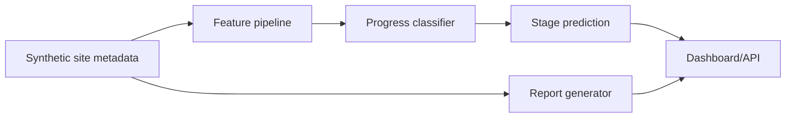
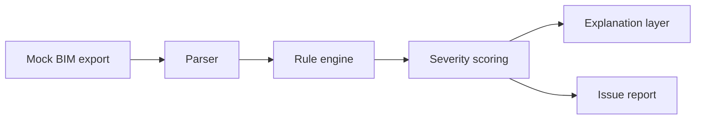
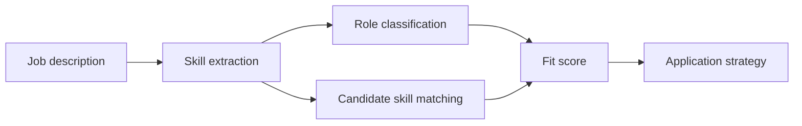
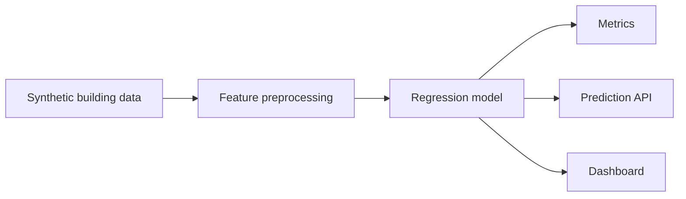
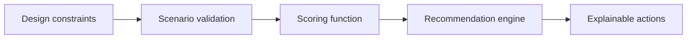

# Architecture Diagrams

## AEC Code Compliance RAG Assistant

## Construction Progress CV Tracker

## BIM Issue Detection Agent

## AI + AEC Job Fit Analyzer

## Building Energy ML Pipeline

## Spatial Design Recommender

