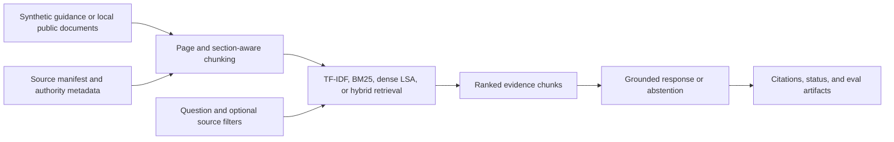
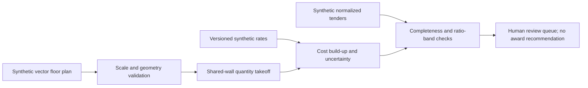
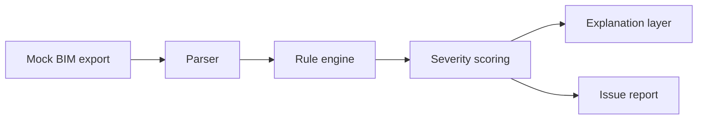
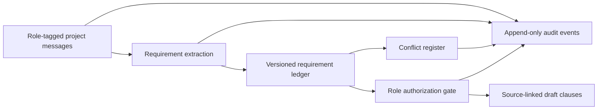
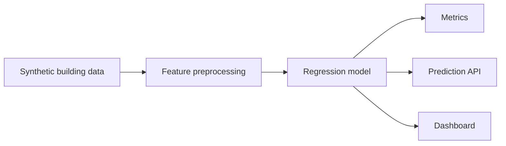
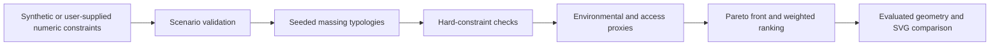
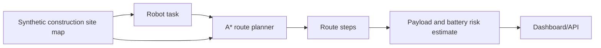
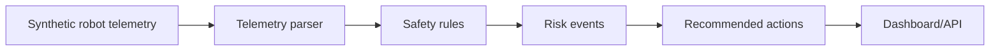

# Architecture Diagrams

## AEC Code Compliance RAG Assistant

## QS Takeoff and Tender Analysis Workbench

## BIM Schedule Rule Checker

## Project Brief and Specification Copilot

## Building Energy Regression Pipeline

## Constraint-Aware Massing Explorer

## Construction Grid Route Planner

## Robot Telemetry Safety Rule Monitor

