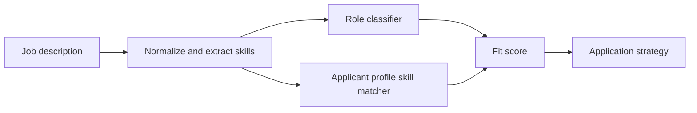

# AI/AEC Job Description Match Baseline

Deterministic keyword-scoring tool that parses job descriptions, compares role signals with a supplied skill profile, identifies unmatched terms, and produces a review summary. It is a matching baseline, not a learned hiring model.

## Problem

Architecture and built-environment professionals moving into AI need a structured way to compare role requirements against project evidence without overclaiming.

## Why It Matters

This project demonstrates how AI engineering, applied AI, and built-environment domain expertise can be mapped against real hiring requirements.

## Demo

```bash
streamlit run experiments/ai-aec-job-fit-analyzer/app.py
```

## Features

- Job description parser
- Skill extraction
- Role classification
- Resume keyword matching
- Gap analysis
- Tailored application strategy output
- Sample job descriptions

## Tech Stack

Python, Streamlit, deterministic NLP rules, pytest.

## Architecture



## How It Works

The analyzer maps job text to skill categories, compares extracted requirements to an applicant profile, and returns a role class with a fit score.

## Example Output

```text
Role type: AI + architecture / AEC
Fit score: 86
Strategy: Lead with AI plus built-environment positioning and show RAG, BIM QA, CV progress, and energy ML projects.
```

## Run Locally

```bash
pip install -r requirements.txt
python scripts/generate_sample_data.py
streamlit run experiments/ai-aec-job-fit-analyzer/app.py
```

## Tests

```bash
pytest tests/test_job_fit.py
```

## Limitations

- Uses transparent keyword rules rather than a large NLP model.
- The bundled resume profile is synthetic demo data, not a real private resume.
- Fit scoring is a decision aid, not a guarantee.

## Deployment-Relevant Extensions

- Add resume upload and structured resume parsing.
- Add LLM-based evidence mapping from portfolio projects to job requirements.
- Add cover-letter and recruiter-message drafts with review controls.

## Evidence

- Transparent token matching and weighted scoring over job text.
- Inspectable matched and missing terms rather than an opaque fit prediction.
- A small career-workflow interface with an explicit non-hiring-model boundary.

## Implementation Notes

- The project uses transparent role rules because the goal is explainable career matching, not opaque resume ranking.
- The output is structured around decisions a job seeker actually makes: role fit, skill gaps, portfolio evidence, and next actions.
- Synthetic sample jobs keep the workflow safe to share while demonstrating how AI can organize ambiguous job descriptions.
- A production version would add resume parsing, LLM evidence extraction, calibrated scoring, prompt/version tracking, and recruiter-message review controls.

## Design Decisions

- Transparent term matching keeps the basis of each fit score inspectable in this hiring-adjacent workflow.
- The role classifier can be evaluated across AI, ML, and AEC postings.
- The project shows how portfolio evidence can be mapped to job requirements.
- The design separates where an LLM could help from where deterministic rules are preferable.
- Fit scores are documented as guidance, not hiring predictions.
