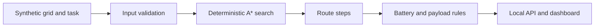

# Construction Grid Route Planner

> **Evidence boundary:** this experiment applies deterministic A* search to a synthetic construction-site grid. It is not a learned policy, motion planner, SLAM system, robot controller, or hardware validation.

The planner routes a simulated material-moving task through blocked, restricted, and slow grid cells, then reports route steps and explicit battery and payload checks.

## Reproduce

From the repository root:

```bash
python scripts/generate_sample_data.py
python -m pytest tests/test_construction_grid_route_planner.py
streamlit run experiments/construction-grid-route-planner/app.py
```

The optional local API runs with:

```bash
python -m uvicorn construction_grid_route_planner.api:app --app-dir experiments/construction-grid-route-planner/src --reload
```

## Implementation

- [`planner.py`](src/construction_grid_route_planner/planner.py) parses the grid and task fixture, runs A* search, assigns route actions, and reports rule-based route risks.
- [`api.py`](src/construction_grid_route_planner/api.py) exposes the bundled tasks and planner through `/tasks` and `/plan`.
- [`app.py`](app.py) visualizes the input grid and computed route.
- [`site_tasks.json`](sample_data/site_tasks.json) is explicitly labeled synthetic input.



## What The Evidence Supports

- A* route generation over explicit blocked, restricted, and slow cells.
- Deterministic path and action outputs for a versioned synthetic fixture.
- Tested handling of infeasible routes, route costs, payload, and battery conditions.
- Local API and UI packaging around the same planner function.

## Limitations

- Grid cells are abstract states, not occupancy-map, localization, or perception outputs.
- The path is not checked against robot footprint, kinematics, acceleration, turning radius, or dynamic obstacles.
- Battery and payload findings are hand-authored demo rules, not calibrated operational limits.
- No ROS 2 integration, physics simulation, fleet scheduling, latency evaluation, hardware, or field data is included.
- Route feasibility must not be interpreted as physical safety or deployability.

## Credible Next Steps

- Add a labeled scenario matrix for path, battery, and payload boundary cases.
- Introduce footprint-aware and time-dependent planning in simulation.
- Add a ROS 2 message adapter and replay harness without granting control authority.
- Evaluate dynamic-obstacle replanning before considering a hardware interface.
