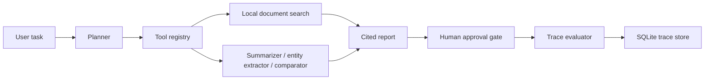

# Architecture

This project is a local planner-executor research workflow. It is not a fully autonomous research agent and does not browse the live web.

## Flow

## Component Boundaries

| Component | File | Responsibility |
| --- | --- | --- |
| Planner | `workflow.py` | Chooses a deterministic tool plan based on the task and allowed tools. |
| Tool registry | `workflow.py` | Describes available tools and approval requirements. |
| Executor | `workflow.py` | Runs tools, retries failures, records status, attempts, and latency. |
| Memory | `workflow.py` | Writes the latest JSON trace to local memory. |
| Trace store | `trace_store.py` | Persists traces and trace evaluations to SQLite. |
| Reporter | `workflow.py` | Builds a cited markdown report from retrieved local evidence. |
| Approval gate | `workflow.py` | Marks the run as requiring human approval before external use. |

## Trace Contract

Every run produces a `WorkflowTrace` with:

- `trace_id`
- `started_at`
- `task`
- `plan`
- `tool_calls`
- `citations`
- `approval_required`
- `final_report`
- `evaluation`

Tool calls include the tool name, arguments, output summary, status, attempt count, and latency.

## Failure Handling

The executor records failed tool calls with `status="error"` and an error summary. The current planner is intentionally deterministic; production work would need better recovery logic, external tool permissions, and stronger evals.

## Productionization Path

- Add authenticated web/search/document connectors.
- Add role-based tool permissions and approval queues.
- Add trace comparison across runs.
- Add richer citation-quality and report-faithfulness evaluation.
- Add retries/backoff per tool type.
- Add red-team cases for prompt injection and unsafe tool access.
