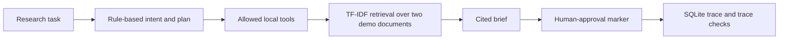

# Deterministic Research Workflow

> **Evidence boundary:** this experiment uses a rule-based planner and deterministic local tools over two bundled demo documents. It is not an adaptive LLM planner, autonomous researcher, live-web agent, or production approval system.

The workflow maps a research task to an allowed tool sequence, retrieves local text, creates a cited brief, records a structured trace in SQLite, evaluates trace properties, and marks the result for human approval.

## Reproduce

From the repository root:

```bash
python experiments/deterministic-research-workflow/scripts/evaluate_workflow.py
python -m pytest tests/test_general_ai_projects.py -k research_workflow
streamlit run experiments/deterministic-research-workflow/app.py
```

## Review Evidence

- [`ARCHITECTURE.md`](ARCHITECTURE.md) maps each component to its implementation file.
- [`EVAL.md`](EVAL.md) defines the six-task synthetic evaluation and metric boundaries.
- [`LIMITATIONS.md`](LIMITATIONS.md) lists unsupported behavior and deployment gaps.
- [`workflow_eval_summary.json`](demo_outputs/workflow_eval_summary.json) contains machine-readable evaluation results.
- [`sample_trace.json`](demo_outputs/sample_trace.json) exposes planner rationale, tool status, attempts, latency, citations, approval state, and evaluation findings.
- [`workflow_eval_report.md`](demo_outputs/workflow_eval_report.md) is regenerated by the evaluation command.

## Implementation

- [`workflow.py`](src/deterministic_research_workflow/workflow.py) contains intent classification, the fixed planning rules, tool registry, retry behavior, local retrieval, report generation, and approval marker.
- [`trace_store.py`](src/deterministic_research_workflow/trace_store.py) persists and retrieves JSON traces and evaluations in SQLite.
- [`evaluate_workflow.py`](scripts/evaluate_workflow.py) runs the versioned synthetic task set and writes stable review artifacts.
- [`app.py`](app.py) exposes the same workflow through a local Streamlit interface.



## What The Evidence Supports

- Deterministic tool selection for report, comparison, extraction, summary, and unsupported-current-information intents.
- Permission filtering, retry traces, denied-tool records, citations, and no-evidence behavior.
- Local trace persistence and checks for citations, tool errors, and approval state.
- Reproducible execution without a paid API.

## Limitations

- The corpus contains two short demo documents, so retrieval quality is not representative of a real research collection.
- Intent classification and planning are keyword rules; they do not learn, adapt, or reason over arbitrary requests.
- The optional provider abstraction formats prose but does not make the default planner adaptive.
- The approval checkpoint is a trace state, not authenticated workflow authorization.
- Citation presence is checked; citation correctness and claim-level entailment are not evaluated.
- No live connectors, access control, concurrent execution, durable queue, or operational service evaluation is included.

## Credible Next Steps

- Add a larger labeled task set with expected plans, source relevance, and no-answer cases.
- Score citation correctness and claim support, not only citation presence.
- Add authenticated connectors and role-based tool permissions in a sandboxed integration test.
- Evaluate failure recovery and approval behavior under concurrent runs.
