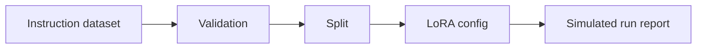

# LoRA Dataset and Configuration Validator

Dataset and configuration validator for a hypothetical support-ticket LoRA experiment. It generates and checks instruction rows, validates split logic, records a LoRA configuration, and produces a simulated run report without loading or updating a model.

Experiment for reviewing pre-training data and configuration checks. Local training is not implemented and no model parameters are updated.

## Problem

Fine-tuning projects often fail before training because datasets, validation, compute assumptions, and evaluation are unclear.

## Demo

```bash
streamlit run experiments/fine-tuning-lora-lab/app.py
```

Evidence docs:

- [DATASET.md](DATASET.md)
- [EVAL.md](EVAL.md)
- [LIMITATIONS.md](LIMITATIONS.md)

## Features

- Instruction dataset generator
- Dataset validation for missing fields, empty values, labels, and duplicates
- Train/validation split verification
- LoRA config structure
- Simulated run report requiring no GPU
- Evaluation template for held-out prompts and overfitting risks
- Clear path for real GPU training

## Tech Stack

Python, dataclasses, Streamlit, and pytest.

## Architecture



## Tests

```bash
python -m pytest tests/test_general_ai_projects.py -k "lora or fine_tuning"
```

## Limitations

- No pretrained model, tokenizer, PEFT adapter, or optimizer is loaded.
- The simulated report validates configuration flow, not model adaptation performance.
- No accuracy, benchmark, or model-quality claim is made.

## Deployment-Relevant Extensions

- Add tokenizer, PEFT/LoRA trainer, GPU instructions, model registry, and held-out evaluation.

## Evidence

Dataset validation, split checks, adaptation-configuration literacy, and explicit separation between planning artifacts and actual model training.

## Implementation Notes

- The validator covers dataset checks, split planning, LoRA configuration, simulated run reporting, and model-card-style documentation.
- The simulated path stays CPU-only and makes the absence of PEFT/LoRA training explicit.
- Dataset quality and leakage checks are treated as prerequisites rather than evidence that adaptation occurred.
- Production use would require tokenizer/model loading, GPU training, experiment tracking, held-out evals, artifact storage, and safety review.

## Design Decisions

- The checked-in validator exposes the data and configuration prerequisites for a hypothetical LoRA experiment.
- Dataset formatting, deduplication, train/validation splits, and leakage risks are treated as first-class concerns.
- The LoRA configuration fields expose key adaptation tradeoffs.
- The evaluation document lists measurements a future trained adapter would need; none are reported here.
- The local simulated report demonstrates configuration handling, not model performance.

