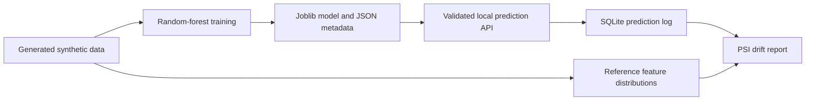

# Local Model Serving and Monitoring Scaffold

> **Evidence boundary:** this experiment trains and serves a random-forest classifier over generated synthetic churn data. It demonstrates local interfaces and records, not a deployed model platform, production monitor, business result, or real customer use.

The project packages one fitted model with schema validation, metadata, a FastAPI prediction endpoint, SQLite inference logs, and population-stability-index drift checks.

## Reproduce

From the repository root:

```bash
python experiments/local-model-serving-monitoring/scripts/evaluate_model.py
python -m pytest tests/test_general_ai_projects.py -k 'model_serving or drift or prediction'
streamlit run experiments/local-model-serving-monitoring/app.py
```

The optional local API runs with:

```bash
python -m uvicorn local_model_serving_monitoring.api:app --app-dir experiments/local-model-serving-monitoring/src --reload
```

## Review Evidence

- [`ARCHITECTURE.md`](ARCHITECTURE.md) maps training, serving, logging, and drift components.
- [`EVAL.md`](EVAL.md) defines the synthetic split and metric boundaries.
- [`MONITORING.md`](MONITORING.md) documents the logged fields and drift interpretation.
- [`LIMITATIONS.md`](LIMITATIONS.md) separates local scaffolding from operational deployment.
- [`model_eval_summary.json`](demo_outputs/model_eval_summary.json) contains the generated metrics and artifact paths.
- [`sample_monitoring_report.json`](demo_outputs/sample_monitoring_report.json) shows local volume, latency, error, and drift fields.

## Implementation

- [`pipeline.py`](src/local_model_serving_monitoring/pipeline.py) generates synthetic data, fits the classifier, validates prediction inputs, and writes joblib plus JSON metadata.
- [`schemas.py`](src/local_model_serving_monitoring/schemas.py) defines strict request and response contracts.
- [`api.py`](src/local_model_serving_monitoring/api.py) exposes `/predict`, `/metrics`, `/health`, and `/model-info` locally.
- [`observability.py`](src/local_model_serving_monitoring/observability.py) stores prediction and drift records in SQLite.
- [`monitoring.py`](src/local_model_serving_monitoring/monitoring.py) computes PSI-based feature comparisons and a local monitoring summary.



## What The Evidence Supports

- A reproducible path from generated training data to a locally served model artifact.
- Strict prediction schemas and rejection of missing, extra, and impossible values.
- Version metadata, prediction logging, drift-history persistence, and report generation.
- Tests for artifact metadata, prediction records, PSI behavior, and drift records.

## Limitations

- All records are generated synthetic churn examples; no real users, labels, or business outcomes are represented.
- Classification metrics on the synthetic split do not establish external model quality.
- PSI is a feature-distribution signal, not proof of concept drift, prediction degradation, or causal change.
- SQLite and local files do not provide concurrency, retention policy, lineage, registry governance, or disaster recovery.
- No authentication, deployment environment, alert transport, delayed-label evaluation, retraining policy, or service-level test is included.

## Credible Next Steps

- Add delayed-label evaluation and alert tests over a versioned synthetic time sequence.
- Separate reference, current, and labeled outcome windows with explicit lineage.
- Add load, concurrency, and failure-recovery tests before discussing service reliability.
- Integrate an external registry or orchestrator only when its behavior can be executed and evidenced locally.
