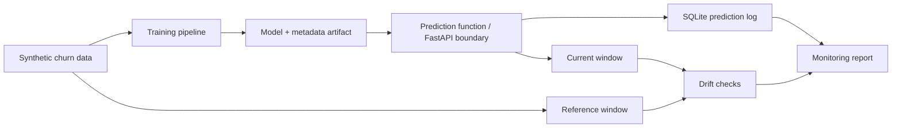

# Architecture

This project is a local MLOps skeleton over synthetic churn data. It demonstrates the shape of model training, artifact metadata, inference logging, and monitoring without claiming production deployment.

## Flow

## Components

| Component | File | Responsibility |
| --- | --- | --- |
| Training | `pipeline.py` | Generates synthetic data, trains a scikit-learn model, returns metrics and schema metadata. |
| Prediction | `pipeline.py` | Validates feature presence and returns churn probability. |
| Artifact registry | `observability.py` | Saves model artifact and JSON metadata locally. |
| Inference log | `observability.py` | Stores request ID, payload, prediction, model version, latency, and errors in SQLite. |
| Drift checks | `monitoring.py` | Computes mean-shift and PSI-style drift scores. |
| Monitoring report | `monitoring.py` | Summarizes volume, latency, errors, drift, and warnings. |
| UI | `app.py` | Streamlit surface for local review. |

## Metadata Contract

Saved model metadata includes:

- model version
- saved/training timestamp
- metrics
- feature schema
- dataset info
- git commit when available
- artifact filename

## Productionization Path

- Replace local artifact folder with a real registry such as MLflow.
- Add migration-managed database schema.
- Add batch feature pipelines and delayed-label evaluation.
- Add alert thresholds and notification routing.
- Add rollback criteria and model promotion gates.
- Add real latency measurement and request tracing.
