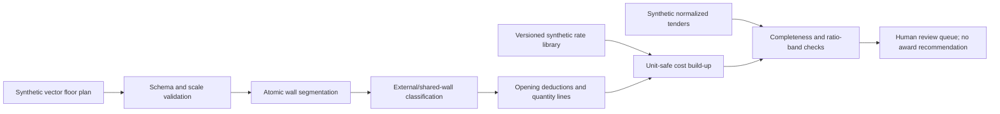

# Architecture

## System Boundary

## Trust Boundaries

| Boundary | Implemented control |
| --- | --- |
| Geometry | Required positive scale; positive dimensions; unique ids; no overlapping rooms |
| Openings | Axis-aligned segments must lie entirely on one classified wall; overlaps are rejected |
| Quantities | Each line stores its formula and source room/opening ids |
| Rates | Version, currency, synthetic-data status, unit, uncertainty, and provenance are required |
| Costing | Unit mismatch raises an error; missing rates remain explicitly unpriced |
| Tenders | Currency must match; exceptions remain line-level and explainable |
| Decision | The system never recommends a bidder or represents professional QS approval |

## Shared-Wall Algorithm

Each rectangular room contributes four boundary intervals. Intervals are grouped by orientation and coordinate, then split at every endpoint. An atomic segment covered by one room boundary is external; a segment covered by two adjoining room boundaries is a partition. This prevents the naive error of counting a shared partition twice as external perimeter.

The implementation supports partial collinear overlaps because classification occurs after endpoint splitting. It rejects room-area overlaps before measurement.

## Quantity Contract

The current schema emits:

| Code | Quantity | Unit |
| --- | --- | --- |
| `QTO-FLR` | Floor finish | m2 |
| `QTO-CEI` | Ceiling finish | m2 |
| `QTO-SLB` | Concrete floor slab | m3 |
| `QTO-EXT` | External walling after openings | m2 |
| `QTO-INT` | Internal partitions after openings, one-face equivalent | m2 |
| `QTO-DOR` | Door sets | ea |
| `QTO-WIN` | Window glazed area | m2 |

This is an intentionally narrow demonstration schema, not a standard method of measurement or bill-of-quantities taxonomy.

## Reproducibility

`evaluate_qs.py` reads immutable JSON fixtures and regenerates all text, JSON, CSV, and SVG evidence in `demo_outputs/`. Repository verification runs the evaluator twice and compares artifact hashes.
