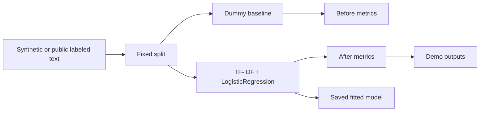

# Local Text Classification Lab

Small text-classification project that fits scikit-learn model parameters locally. It has two training paths: a fast synthetic portfolio-task classifier and a locally bundled UCI SMS Spam subset classifier with train/validation/test splits, baseline comparison, saved fitted models, and generated metrics.

This is conventional TF-IDF plus logistic-regression training, not fine-tuning of a pretrained language model.

## Problem

Some projects in this repository use mock provider boundaries. This lab provides a small, runnable example where training changes model parameters and produces measurable before-and-after metrics.

## Demo

```bash
streamlit run experiments/real-model-finetune-lab/app.py
```

Generate model artifacts:

```bash
python experiments/real-model-finetune-lab/evaluate_model.py
```

Evaluation protocol and interpretation limits: [EVAL.md](EVAL.md).

## Features

- Synthetic but labeled text-classification dataset with fixed train/eval splits.
- Larger public-dataset path using a deterministic, source-traceable UCI SMS Spam Collection subset with train/validation/test splits.
- Real scikit-learn training using `TfidfVectorizer` and `LogisticRegression`.
- Dummy-classifier baseline for before/after comparison.
- Fitted model artifacts generated under `.artifacts/real-model-finetune-lab/` during local evaluation. Runtime binaries are ignored by Git; metrics and reports remain versioned in `demo_outputs/`.
- Metrics JSON, public confusion matrix, sample prediction JSON, and model card/report docs.
- Tests that confirm both trained models improve over baseline and expose learned coefficients.

## Training Paths

| Path | Dataset | Split | Outputs |
| --- | --- | --- | --- |
| Synthetic quick path | 27 synthetic portfolio-task examples | fixed train/eval | Versioned metrics, prediction, and model card; locally generated `text_classifier.joblib` |
| Public SMS path | 240-row deterministic balanced subset of the UCI SMS Spam Collection | 160 train, 40 validation, 40 test | Source-row manifest, versioned metrics, confusion matrix, and report; locally generated `public_sms_classifier.joblib` |

## Current Measured Results

| Metric | Result |
| --- | --- |
| Public SMS baseline accuracy | `0.500` |
| Public SMS validation accuracy | `0.850` |
| Public SMS test accuracy | `0.950` |
| Public SMS test macro-F1 | `0.950` |

These values come from the fixed compact subset and are checked against [`demo_outputs/public_sms_metrics.json`](demo_outputs/public_sms_metrics.json). See [EVAL.md](EVAL.md) for the protocol and sampling limitations.

Dataset source notes for the public path are in [sample_data/uci_sms_subset_README.md](sample_data/uci_sms_subset_README.md).

Rebuild or verify the checked-in subset provenance:

```bash
python experiments/real-model-finetune-lab/scripts/build_uci_sms_subset.py
python experiments/real-model-finetune-lab/scripts/build_uci_sms_subset.py --check
```

## Tech Stack

Python, scikit-learn, joblib, pandas, Streamlit, pytest.

## Architecture



## Tests

```bash
python -m pytest tests/test_real_model_finetune_lab.py
```

## Evidence

Real model fitting, before/after evaluation, public-dataset held-out testing, saved model artifact handling, lightweight NLP feature extraction, and honest distinction between data source quality and learned weights.

## Implementation Notes

- Both models are intentionally CPU-friendly and fast enough for CI.
- The synthetic path is tiny and deterministic; the public SMS path is larger and more credible while still locally bundled.
- The baseline is deliberately weak so the evaluation shows whether training adds measurable signal.
- The evaluator saves fitted binaries locally and keeps deterministic metrics and reports under version control.

## Design Decisions

- Why a small fitted classifier is more honest than claiming a mock LoRA run updated weights.
- How fixed splits make the before/after metrics repeatable.
- Why the public SMS path uses a held-out test set and confusion matrix.
- Where the learned parameters live in the logistic-regression coefficients.
- What would be needed to upgrade this into a larger transformer or LoRA experiment.

## Limitations

- Synthetic quick-path dataset is intentionally small.
- Public SMS subset is compact and should not replace full-corpus benchmarking.
- This is classical ML, not transformer fine-tuning.
- Metrics demonstrate workflow correctness, not production NLP quality.
- No hosted model registry or production deployment is claimed.

## Credible Next Steps

- Evaluate against the complete public corpus with repeated stratified splits.
- Add probability calibration and document threshold selection by error cost.
- Compare the classical baseline with a compact transformer under the same held-out protocol.
