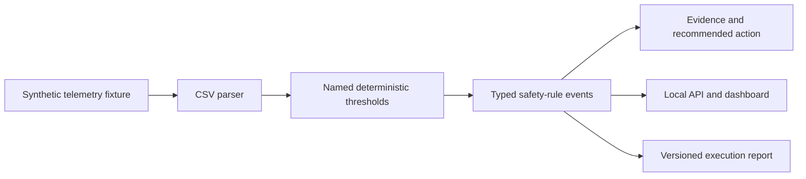

# Robot Telemetry Safety Rule Monitor

> **Evidence boundary:** this experiment applies hand-authored deterministic rules to 36 synthetic telemetry rows. It is not a learned safety model, labeled detection benchmark, certified safety system, or physical robot validation.

This supporting construction-robotics experiment executes inspectable telemetry rules for worker proximity, obstacle clearance, restricted-zone speed, payload stability, and emergency-stop signals.

## Current Fixture Result

| Check | Artifact-backed result |
| --- | ---: |
| Synthetic telemetry rows | `36` |
| Emitted rule events | `26` |
| High-severity events | `19` |
| Medium-severity events | `7` |

The first emitted event is `worker_proximity`: "Worker distance 0.76 m while speed was 1.06 m/s." It is traced to the checked-in synthetic telemetry rather than written as an illustrative result.

[`safety_monitor_demo_summary.json`](demo_outputs/safety_monitor_demo_summary.json) contains the thresholds, counts, event distribution, and first event. [`safety_monitor_demo_report.md`](demo_outputs/safety_monitor_demo_report.md) explains why these counts are an execution result rather than a precision or recall evaluation.

## Reproduce

From the repository root:

```bash
python experiments/robot-telemetry-rule-monitor/generate_demo_report.py
python -m pytest tests/test_robot_telemetry_rule_monitor.py
```

## Implementation

- [`monitor.py`](src/robot_telemetry_rule_monitor/monitor.py) defines named rule thresholds and emits typed event records with source evidence and a recommended action.
- [`api.py`](src/robot_telemetry_rule_monitor/api.py) exposes the generated event register through `/safety-events`.
- [`app.py`](app.py) displays the synthetic telemetry, severity counts, and emitted events.
- [`generate_demo_report.py`](generate_demo_report.py) regenerates the versioned JSON and Markdown evidence.

## Architecture



## Run The Interfaces

```bash
streamlit run experiments/robot-telemetry-rule-monitor/app.py
python -m uvicorn robot_telemetry_rule_monitor.api:app --app-dir experiments/robot-telemetry-rule-monitor/src --reload
```

## What The Evidence Supports

- Deterministic rule execution over a versioned synthetic telemetry fixture.
- Exact tracing from input values to the event evidence string.
- Explicit rule thresholds and tests for high-risk, boundary, empty-input, and artifact-consistency behavior.

## Evaluation Gap

The fixture does not contain independently labeled safety events. Therefore, precision, recall, false-positive rate, and false-negative rate are unknown. Event counts must not be read as detection quality.

## Limitations

- All telemetry is synthetic; no ROS bags, sensor streams, customer data, employer data, or real construction-project data are included.
- Thresholds are demonstration values and are not derived from or validated against a robotics safety standard.
- No perception confidence, sensor fusion, localization, map state, moving-worker prediction, latency test, controller integration, or fail-safe mechanism is modeled.
- Recommended actions are explanatory demo text, not control commands or professional safety instructions.
- The project provides no evidence of physical safety, field readiness, certification, or deployment.

## Credible Next Steps

- Create an independently labeled synthetic test matrix covering each threshold boundary and multi-event case.
- Report confusion matrices and failure slices only after labeled truth is available.
- Define a ROS 2 message adapter and replay harness without implying live-control authority.
- Map requirements to applicable standards with qualified robotics-safety review before changing thresholds.
