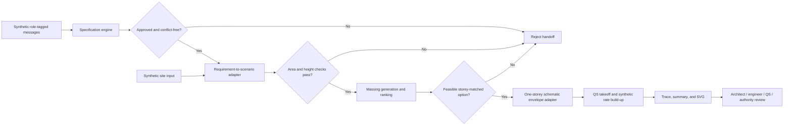

# Architecture

## Contract Boundary

## Components

| Component | Responsibility | Deliberately excluded |
| --- | --- | --- |
| `project_specification_copilot` | Extract requirements, retain source message ids, enforce role-scoped approval, and expose conflicts | Open-domain language understanding or authenticated user identity |
| `shared.aec_workflow.runner` | Validate required approvals, map source records, enforce cross-project invariants, and assemble the trace | Inventing missing values or resolving professional decisions |
| `constraint_aware_massing_explorer` | Generate candidates, evaluate hard constraints and proxies, and rank feasible options | Building-code inference, internal planning, engineering, or calibrated simulation |
| Schematic-plan adapter | Convert selected non-overlapping mass footprints into typed `Room` rectangles | Claiming that masses are rooms or that the output is a developed floor plan |
| `qs_takeoff_tender_analysis` | Measure the bounded envelope and join quantities to source-labeled synthetic rates | Market pricing, complete elemental cost planning, or award recommendation |
| Renderer | Generate a diagram from the same trace JSON | Independent evidence or manually entered metrics |

## Source Model

Every massing input has a source entry:

- `target_gfa_m2`, `requested_storey_count`, and site-area validation refer to approved requirement ids and source message ids;
- geometry, setback, environmental, access, and objective fields refer to the synthetic site-input id;
- the selected candidate id is retained in the schematic plan and every downstream output;
- quantity lines retain room and wall-segment source references;
- cost lines retain both quantity references and synthetic rate provenance.

The trace stores `source_coverage = 1.0` only because all 16 fields in this authored schema have source entries. It does not mean the synthetic inputs are correct, complete, or professionally validated.

## Fail-Closed Rules

The runner rejects the handoff when:

- any required requirement is missing or unapproved;
- a required requirement has an unresolved conflict;
- the approved site area disagrees with supplied dimensions beyond 0.1 percent;
- approved storeys exceed the supplied height limit at the supplied floor-to-floor height;
- candidate count or slab thickness is invalid;
- no feasible candidate matches the approved storey count.

## Reproducibility

The fixture fixes the massing seed and candidate count. `trace_version` is the first 12 characters of a SHA-256 digest over the canonical trace before that version field is added. Generated artifacts exclude timestamps and machine-specific paths.
