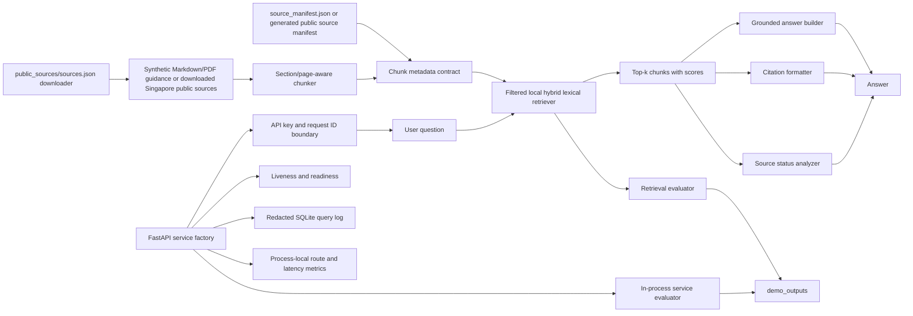

# Architecture

This project is a local RAG assistant for AEC guidance, not a source of compliance advice. The default path uses synthetic documents; the optional public-source path downloads official Singapore BCA, URA, NEA, SCDF, LTA, PUB, and NParks documents locally for more realistic retrieval testing.

## System Flow

## Module Boundaries

| Area | File | Responsibility |
| --- | --- | --- |
| Chunking | `src/aec_code_compliance_rag/chunking.py` | Splits markdown by headings, preserves page markers, converts PDF page text into chunks, and emits chunk metadata. |
| PDF ingestion | `src/aec_code_compliance_rag/pdf_ingestion.py` | Extracts text page by page from PDFs with `pypdf` and passes real page numbers into the chunk metadata contract. |
| Source manifest | `src/aec_code_compliance_rag/source_manifest.py` | Loads `source_manifest.json` and applies source title, type, allowed-use, jurisdiction, version, and superseded metadata. |
| Public sources | `src/aec_code_compliance_rag/public_sources.py` | Downloads official public Singapore source documents to an ignored local folder and generates source metadata for retrieval. |
| Retrieval | `src/aec_code_compliance_rag/retrieval.py` | Provides TF-IDF, BM25, dense LSA, hybrid retrieval, and optional sentence-transformer/cross-encoder modes over local chunks. |
| Assistant | `src/aec_code_compliance_rag/assistant.py` | Builds the retrieval boundary, applies explicit and inferred authority/document source filters, handles questions, formats citations, checks source status, checks support, and returns abstention statuses. |
| Faithfulness | `src/aec_code_compliance_rag/faithfulness.py` | Applies deterministic citation-marker and lexical-support checks for demo answers. |
| Observability | `src/aec_code_compliance_rag/observability.py` | Persists request ids, operation status, filters, error types, and redacted query metadata to a migration-tolerant local SQLite table. Full payload storage requires explicit opt-in. |
| Service boundary | `src/aec_code_compliance_rag/service.py` | Builds the FastAPI app, validates request schemas, fails closed on absent/invalid API keys, attaches bounded request ids, distinguishes liveness/readiness, and records in-memory route/status/latency metrics. |
| Evaluation | `src/aec_code_compliance_rag/evaluation.py` | Loads evaluation cases and computes retrieval metrics. |
| Evaluation CLI | `evaluate_retrieval.py` | Runs the evaluator and writes versioned artifacts in `demo_outputs/`. |
| Service evaluation CLI | `evaluate_service.py` | Runs deterministic in-process ASGI contract checks and writes versioned service evidence. |
| Demo UI | `app.py` | Streamlit interface for local question answering and citation inspection. |
| API entrypoint | `api.py` | Loads environment-backed settings and exposes the service factory app to Uvicorn. |

## Data Contract

Every retrieved chunk carries this metadata:

| Field | Meaning |
| --- | --- |
| `source` | Original demo document filename. |
| `title` | Human-readable document title from the manifest or source filename. |
| `source_type` | Document type such as `markdown` or `pdf`. |
| `allowed_use` | Synthetic allowed-use label from the source manifest. |
| `publisher` | Publisher for public-source records, such as BCA, URA, NEA, SCDF, LTA, PUB, or NParks. |
| `source_url` | Official source URL captured by the downloader manifest. |
| `rights` | Local-use and redistribution boundary note. |
| `downloaded_at` | Timestamp for public-source download snapshots. |
| `source_note` | Short note describing the source's role in the corpus. |
| `document_id` | Stable document identifier derived from the source. |
| `jurisdiction` | Synthetic jurisdiction label when supplied in the document header. |
| `code_year` | Synthetic code year when supplied in the document header. |
| `document_version` | Synthetic document version when supplied in the document header. |
| `superseded` | Whether the synthetic document marks itself as superseded. |
| `section` | Markdown section title used for retrieval grouping. |
| `heading` | Human-readable heading shown in citations. |
| `clause_id` | Deterministic synthetic clause identifier derived from the heading. |
| `page` | PDF page number or optional demo page marker from markdown comments. |
| `chunk_id` | Stable chunk identifier for tests, evals, and citations. |
| `start_word` / `end_word` | Word offsets within the section body. |

The sample corpus includes markdown files, a generated text-based PDF addendum, and `sample_data/source_manifest.json`. Markdown page values come from comments such as `<!-- page: 2 -->`; PDF page values come from page-by-page extraction with `pypdf`. The manifest is the local place where document title, type, allowed use, jurisdiction, version, and superseded state are made explicit.

The optional public corpus uses `public_sources/sources.json` as the committed source inventory, downloads official public documents into ignored `public_sources/downloaded/`, and writes a generated `source_manifest.json` for chunk metadata. Downloads fail on HTTP errors or extension/content mismatches. Each accepted source records its resolved URL, byte count, and SHA-256; the manifest also records deterministic inventory and corpus fingerprints. This supports reproducible public-document retrieval experiments without committing copied government PDFs.

## Retrieval Design

The default retriever combines local TF-IDF and BM25 scores, then applies a small lexical coverage boost. The project also includes TF-IDF-only, BM25-only, and dense LSA modes for comparison. These committed modes stay runnable without paid APIs, local model downloads, or external infrastructure. Exact chunk text, component scores, dense scores, metadata, filters, and citations remain inspectable.

Optional `semantic` and `hybrid_cross_encoder` modes use `sentence-transformers` for embedding retrieval and cross-encoder reranking. They are useful extension points, but the default review path does not require downloading model weights.

The assistant can rebuild a temporary retriever over a filtered source subset for a query. Supported local filters include jurisdiction, source type, and superseded status. For the Singapore public-source corpus, the assistant also applies conservative authority and document-family inference. A question that names BCA, PUB, NParks, URA, NEA, SCDF, or LTA is restricted to that publisher when matching sources exist. A question that names a specific document family, such as BCA Code on Accessibility, PUB Surface Water Drainage, or NParks Greenery Provision and Tree Conservation, is restricted to that document ID. Manual source filters still take precedence.

In a deployment-oriented extension, the same assistant boundary could support:

- Hosted or local embedding retrieval combined with the current portable baselines.
- Cross-encoder or LLM reranking.
- Discipline and source-permission filters.
- Versioned indexes for superseded and current clauses.

## Citation Design

Citations are structured dictionaries, not just rendered strings. Each citation includes:

- `citation_id`, for answer references such as `[C1]`.
- `source`, `title`, `source_type`, `allowed_use`, `heading`, `clause_id`, `page`, and `chunk_id`.
- public-source provenance fields such as `publisher`, `source_url`, `rights`, `downloaded_at`, and `source_note`.
- `score`, which exposes the retriever's relative confidence.
- retrieval-specific scores such as `tfidf_score`, `bm25_score`, or `dense_score`.
- `excerpt`, so the answer evidence is visible.
- `reference`, a readable citation label.
- version and source-status fields such as `document_version`, `jurisdiction`, `code_year`, and `superseded`.

This makes citations easy to display in Streamlit, test in pytest, and export in demo outputs.

## Source Status Warnings

The assistant inspects citation metadata before returning an answer. If retrieved evidence includes superseded sources, multiple document versions, multiple jurisdictions, or multiple code years, the response includes a `source_status` object and a visible source-status note in the answer. The answer can still be returned, but the status warning makes clear that the governing source set needs review.

This is deterministic metadata handling, not legal validation. It models an important production concern: compliance-oriented RAG systems need to identify when retrieved evidence may come from the wrong source set before a person relies on the answer.

## No-Result Handling

The assistant returns an abstention status when:

- The question is empty.
- Retrieval finds no chunks above the score threshold.
- The question asks for live/current law, permit approval, professional sign-off, or content outside the synthetic corpus.
- The question asks for parcel-, site-, or project-specific facts while no project records are present.
- Retrieved text is too weakly aligned with the question after lexical support checks.

For compliance-oriented workflows, this behavior is more important than always generating a fluent answer.

## Local Service Contract

The FastAPI boundary is deliberately small and fail-closed:

- `/health/live` confirms only that the process can answer HTTP requests.
- `/health/ready` confirms that an API key is configured, the selected corpus exists, and the default hybrid retriever can be built.
- `/sources`, `/query`, `/retrieve`, `/logs/recent`, and `/metrics` require a shared `X-API-Key`.
- Client-supplied request IDs are accepted only when they match a bounded 64-character token pattern; otherwise the service generates one.
- Query and response payloads are redacted from SQLite by default. Full payload storage is an explicit local configuration choice.
- Metrics are process-local counters and a bounded latency sample. Unmatched URLs share one label to bound route cardinality; all metrics reset when the process restarts.

`evaluate_service.py` verifies these interface behaviors with an in-process ASGI client. It does not exercise TLS, reverse proxies, multiple workers, network failure, load, secret rotation, identity-aware authorization, distributed telemetry, or an external deployment.

## Production Extension Points

The current project is intentionally local and synthetic. A serious applied extension would add:

- Layout-aware PDF parsing for tables, scanned documents, OCR fallback, and clause segmentation.
- Source inventory validation against authorized or public documents, including Singapore amendment refresh checks.
- Stronger source conflict detection for contradictory clauses and superseded guidance.
- Hosted/local embedding retrieval and reranking.
- Stronger answer-faithfulness evaluation against retrieved chunks.
- Human approval workflow for compliance-sensitive responses.
- Monitoring for no-result rate, citation coverage, low-score answers, and stale documents.
- Identity-aware authorization, managed secrets, rate limiting, durable audit storage, distributed telemetry, and load/security testing.
