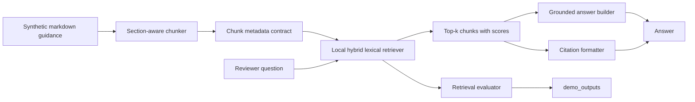

# Architecture

This project is a local, synthetic-data RAG assistant for AEC guidance. It is designed to be inspectable by recruiters and technical reviewers, not to provide real compliance advice.

## System Flow

## Module Boundaries

| Area | File | Responsibility |
| --- | --- | --- |
| Chunking | `src/aec_code_compliance_rag/chunking.py` | Splits markdown by headings, preserves page markers, and emits chunk metadata. |
| Retrieval | `src/aec_code_compliance_rag/retrieval.py` | Provides TF-IDF, BM25, and hybrid lexical retrieval over local chunks. |
| Assistant | `src/aec_code_compliance_rag/assistant.py` | Builds the retrieval boundary, handles questions, formats citations, checks support, and returns abstention statuses. |
| Faithfulness | `src/aec_code_compliance_rag/faithfulness.py` | Applies deterministic citation-marker and lexical-support checks for demo answers. |
| Evaluation | `src/aec_code_compliance_rag/evaluation.py` | Loads evaluation cases and computes retrieval metrics. |
| Evaluation CLI | `evaluate_retrieval.py` | Runs the evaluator and writes reviewer artifacts in `demo_outputs/`. |
| Demo UI | `app.py` | Streamlit interface for local question answering and citation inspection. |

## Data Contract

Every retrieved chunk carries this metadata:

| Field | Meaning |
| --- | --- |
| `source` | Original demo document filename. |
| `document_id` | Stable document identifier derived from the source. |
| `jurisdiction` | Synthetic jurisdiction label when supplied in the document header. |
| `code_year` | Synthetic code year when supplied in the document header. |
| `document_version` | Synthetic document version when supplied in the document header. |
| `superseded` | Whether the synthetic document marks itself as superseded. |
| `section` | Markdown section title used for retrieval grouping. |
| `heading` | Human-readable heading shown in citations. |
| `clause_id` | Deterministic synthetic clause identifier derived from the heading. |
| `page` | Optional demo page marker from markdown comments. |
| `chunk_id` | Stable chunk identifier for tests, evals, and citations. |
| `start_word` / `end_word` | Word offsets within the section body. |

The current corpus is markdown, so page values come from comments such as `<!-- page: 2 -->`. A production extension would replace this with PDF parser output and versioned source metadata.

## Retrieval Design

The default retriever combines local TF-IDF and BM25 scores, then applies a small lexical coverage boost. It stays runnable without paid APIs, local model downloads, or external infrastructure. This is intentionally transparent: reviewers can inspect exact chunk text, component scores, metadata, and citations.

In a deployment-oriented extension, the same assistant boundary could support:

- Embedding retrieval combined with the current lexical baseline.
- Cross-encoder or LLM reranking.
- Jurisdiction, discipline, document type, and code-year filters.
- Versioned indexes for superseded and current clauses.

## Citation Design

Citations are structured dictionaries, not just rendered strings. Each citation includes:

- `citation_id`, for answer references such as `[C1]`.
- `source`, `heading`, `clause_id`, `page`, and `chunk_id`.
- `score`, so reviewers can see retrieval confidence.
- `excerpt`, so the answer evidence is visible.
- `reference`, a readable citation label.

This makes citations easy to display in Streamlit, test in pytest, and export in demo outputs.

## No-Result Handling

The assistant returns an abstention status when:

- The question is empty.
- Retrieval finds no chunks above the score threshold.
- The question asks for live/current law, permit approval, professional sign-off, or content outside the synthetic corpus.
- Retrieved text is too weakly aligned with the question after lexical support checks.

For compliance-oriented workflows, this behavior is more important than always generating a fluent answer.

## Production Extension Points

The current project is intentionally local and synthetic. A serious applied extension would add:

- PDF ingestion with page extraction and clause parsing.
- Source document versioning and jurisdiction metadata.
- Embedding retrieval, reranking, and filterable search.
- Stronger answer-faithfulness evaluation against retrieved chunks.
- Human approval workflow for compliance-sensitive responses.
- Monitoring for no-result rate, citation coverage, low-score answers, and stale documents.
