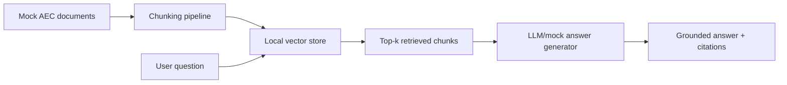

# AEC Code Compliance RAG Assistant

LLM-style retrieval assistant for answering questions over synthetic building-code, planning, accessibility, and internal design-standard documents.

## Problem

Architecture and construction teams often need to search across code clauses, planning notes, accessibility guidance, and internal QA standards before issuing drawings. Manual lookup is slow, and unsupported LLM answers are risky.

## Why It Matters

The project shows how an AI engineer can build source-grounded document assistance for real AEC workflows without claiming production-grade legal compliance.

## Demo

```bash
streamlit run projects/aec-code-compliance-rag/app.py
```

Ask questions such as:

- What accessible route and doorway checks are needed?
- What should be reviewed for fire-rated corridors?
- What assumptions should be logged before a planning submission?

## Features

- Markdown document ingestion
- Word-window chunking with overlap
- Local TF-IDF retrieval as a transparent vector-search stand-in
- Mock LLM answer generation when no API key is available
- Source citations with relevance scores
- Empty-input handling and retrieval tests
- Synthetic evaluation questions in `sample_data/evaluation_questions.json`

## Tech Stack

Python, Streamlit, scikit-learn, FastAPI-compatible provider abstraction, pytest.

## Architecture



## How It Works

1. Markdown documents in `sample_data/` are loaded as synthetic guidance.
2. Documents are split into overlapping chunks.
3. A TF-IDF vector store retrieves chunks relevant to the question.
4. The assistant builds a grounded prompt from retrieved context.
5. The response includes the answer and the evidence used.

## Example Output

```text
Question: What should I check for accessible rooms?
Answer: Review clear public routes, doorway clear width, thresholds, and accessibility notes.
Sources: mock_aec_guidance.md, score 0.42
```

## Run Locally

```bash
pip install -r requirements.txt
python scripts/generate_sample_data.py
streamlit run projects/aec-code-compliance-rag/app.py
```

## Tests

```bash
pytest tests/test_rag.py
```

## Limitations

- Uses synthetic documents.
- TF-IDF is transparent and local but weaker than production embeddings.
- The mock LLM is deterministic and does not replace expert code review.

## How I Would Improve This In Production

- Add PDF parsing and clause-level metadata.
- Add evaluation sets for retrieval precision and faithfulness.
- Add human review workflows for code-compliance signoff.

## What This Proves To Employers

- LLM engineering and RAG fundamentals
- Source-grounded response design
- Hallucination mitigation through citation and incomplete-evidence handling
- Practical AEC workflow framing

## Engineering Notes

- The retrieval path is deliberately transparent: deterministic chunking, TF-IDF scoring, and citation-first answers make it easy to inspect why a response was produced.
- Mock LLM mode keeps the demo runnable without paid APIs while preserving the same input/output contract a hosted LLM provider would use.
- The answer flow refuses to overstate certainty when retrieved evidence is weak, which is more important for compliance workflows than producing polished text.
- Production use would need document ingestion, jurisdiction metadata, clause-level versioning, expert review, and retrieval/eval benchmarks before any code-compliance claims.

## Interview Talking Points

- Explain why source grounding matters more than answer fluency in AEC compliance workflows.
- Walk through the chunking and retrieval tradeoff between interpretability and semantic recall.
- Discuss how you would evaluate faithfulness, citation accuracy, and retrieval precision.
- Describe the mock provider boundary and how a hosted LLM or embedding model would plug in.
- Be explicit that this is decision support, not professional code advice.
