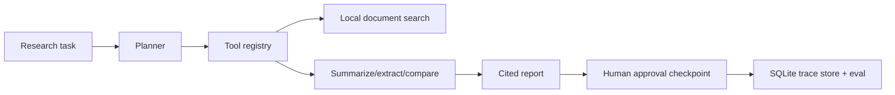

# Agentic Research Operations Assistant

Planner-executor research agent that breaks a task into tool calls, searches local documents, creates a cited report, stores persistent SQLite traces, evaluates the trace, and requires human approval before finalization.

Supporting flagship project for agentic AI workflow review.

## Problem

Research agents can be useful only when their plans, tools, citations, and approval checkpoints are inspectable.

## Demo

```bash
streamlit run projects/agentic-research-ops-assistant/app.py
```

Reviewer artifacts:

- [ARCHITECTURE.md](ARCHITECTURE.md)
- [LIMITATIONS.md](LIMITATIONS.md)
- [demo_outputs/example_trace.json](demo_outputs/example_trace.json)
- [demo_outputs/example_report.md](demo_outputs/example_report.md)

## Features

- Planner-executor architecture
- Local document search with TF-IDF retrieval
- Tool registry with permission-aware planning
- Explicit planner / tool / executor / memory / reporter / approval-gate separation
- Citation tracking
- Structured tool traces with status, attempts, and latency
- SQLite trace persistence
- Trace evaluation for citations, tool failures, and approval checks
- Human approval checkpoint
- Memory persistence

## Tech Stack

Python, Streamlit, Pydantic, SQLite, local vector search, mock LLM provider.

## Architecture



## Limitations

- Uses local mock documents.
- Tool execution is deterministic and intentionally small, but each tool call is now traced with status, attempts, and latency.

## How I Would Improve This In Production

- Add web search connectors, PDF ingestion, richer memory, richer retry policies, and larger eval suites.
- Add review queues and role-based approvals.

## What This Proves To Employers

Agentic AI engineering, tool calling, RAG, workflow orchestration, trace persistence, observability, and human-in-the-loop design.

## Engineering Notes

- The assistant is organized as a planner-executor workflow with a small tool registry, permission-aware planning, local document search, structured outputs, and approval checkpoints.
- Deterministic local documents keep the agent auditable and runnable while demonstrating the same control flow needed for external tools.
- Each run is persisted to SQLite with the full trace and a simple evaluation result so reviewers can inspect repeatable agent behavior.
- Human-in-the-loop review is treated as part of the system design, not an afterthought, because research agents can easily overreach.
- Production use would add authenticated connectors, richer retrieval, role-based tool permissioning, stronger retries, and evals for citation quality.

## Technical Review Discussion Points

- Reviewers can inspect the planner, tool registry, retrieval, approval loop, persisted trace, and trace evaluation in order.
- The design shows how an agent can reduce unsupported claims through retrieved evidence and citations.
- The project makes the boundary between local RAG and live web/tool access explicit.
- Observability needs are represented through persisted traces, tool calls, citations, latency, attempts, evaluation findings, and failure states.
- The project is framed as practical agent orchestration rather than a generic chatbot.

