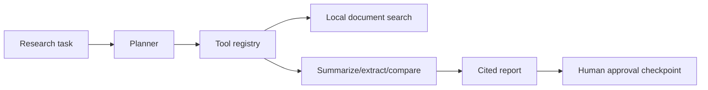

# Agentic Research Operations Assistant

Planner-executor research agent that breaks a task into tool calls, searches local documents, creates a cited report, stores a trace, and requires human approval before finalization.

## Problem

Research agents can be useful only when their plans, tools, citations, and approval checkpoints are inspectable.

## Demo

```bash
streamlit run projects/agentic-research-ops-assistant/app.py
```

## Features

- Planner-executor architecture
- Local document search with TF-IDF retrieval
- Tool registry style methods
- Citation tracking
- Agent trace as structured JSON
- Human approval checkpoint
- Memory persistence

## Tech Stack

Python, Streamlit, Pydantic, local vector search, mock LLM provider.

## Architecture



## Limitations

- Uses local mock documents.
- Tool execution is deterministic and intentionally small.

## How I Would Improve This In Production

- Add web search connectors, PDF ingestion, richer memory, retries, and eval traces.
- Add review queues and role-based approvals.

## What This Proves To Employers

Agentic AI engineering, tool calling, RAG, workflow orchestration, observability, and human-in-the-loop design.

## Engineering Notes

- The assistant is organized as a planner-executor workflow with a small tool registry, local document search, structured outputs, and approval checkpoints.
- Deterministic local documents keep the agent auditable and runnable while demonstrating the same control flow needed for external tools.
- Human-in-the-loop review is treated as part of the system design, not an afterthought, because research agents can easily overreach.
- Production use would add authenticated connectors, richer retrieval, tool permissioning, persistent traces, retries, and evals for citation quality.

## Interview Talking Points

- Explain the planner, tools, retrieval, and approval loop in order.
- Discuss how you prevent an agent from making unsupported claims.
- Walk through how local RAG differs from live web/tool access.
- Describe observability needs for agent runs: traces, tool calls, citations, and failures.
- Position the project as practical agent orchestration rather than a generic chatbot.

