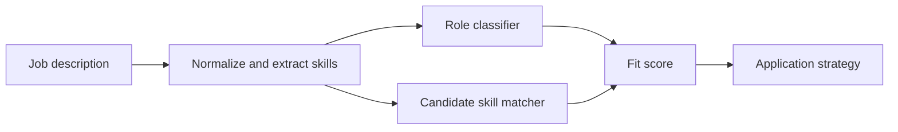

# AI Job Market Fit Analyzer for AI + Architecture Roles

Personal career tool that parses job descriptions, classifies role fit, extracts skill signals, identifies gaps, and generates a tailored application strategy.

## Problem

Candidates pivoting from architecture into AI need to decide which roles fit their background and how to position project evidence without overclaiming.

## Why It Matters

This project connects directly to the candidate story: AI engineering, applied AI, and built-environment domain expertise.

## Demo

```bash
streamlit run projects/ai-aec-job-fit-analyzer/app.py
```

## Features

- Job description parser
- Skill extraction
- Role classification
- Resume keyword matching
- Gap analysis
- Tailored application strategy output
- Sample job descriptions

## Tech Stack

Python, Streamlit, deterministic NLP rules, pytest.

## Architecture



## How It Works

The analyzer maps job text to skill categories, compares extracted requirements to the candidate's AI plus AEC positioning, and returns a role class with a fit score.

## Example Output

```text
Role type: AI + architecture / AEC
Fit score: 86
Strategy: Lead with AI plus built-environment positioning and show RAG, BIM QA, CV progress, and energy ML projects.
```

## Run Locally

```bash
pip install -r requirements.txt
python scripts/generate_sample_data.py
streamlit run projects/ai-aec-job-fit-analyzer/app.py
```

## Tests

```bash
pytest tests/test_job_fit.py
```

## Limitations

- Uses transparent keyword rules rather than a large NLP model.
- The resume profile is a placeholder and should be customized.
- Fit scoring is a decision aid, not a guarantee.

## How I Would Improve This In Production

- Add resume upload and structured resume parsing.
- Add LLM-based evidence mapping from portfolio projects to job requirements.
- Add cover-letter and recruiter-message drafts with review controls.

## What This Proves To Employers

- NLP product thinking
- Structured classification
- Honest career-positioning automation
- Ability to connect AI systems to a real user workflow
