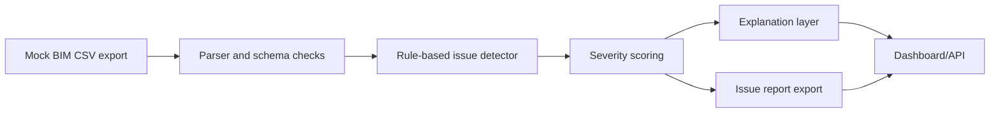

# BIM / Drawing Issue Detection Agent

AI-assisted QA tool that parses mock BIM room schedules, flags likely coordination issues, scores severity, and generates an exportable issue report.

## Problem

Design teams spend many hours checking room schedules, drawing notes, and coordination comments for missing or inconsistent information.

## Why It Matters

AEC AI products often begin with structured data validation. This project shows practical automation before adding an explanation layer.

## Demo

```bash
streamlit run projects/bim-issue-detection-agent/app.py
```

## Features

- CSV parser for mock BIM exports
- Rule-based issue detection
- Severity scoring
- Mock/optional LLM explanation layer
- Exportable markdown issue report
- FastAPI `/issues` endpoint

## Tech Stack

Python, pandas, FastAPI, Streamlit, pytest.

## Architecture



## How It Works

The detector checks room names, duplicate IDs, area mismatches, door clearance conflicts, material specifications, fire-rating notes, accessibility notes, and unresolved coordination comments.

## Example Outputs

```text
A-102 duplicate_room_id high
B-210 door_clearance_conflict high
C-305 missing_fire_rating_note high
```

## Run Locally

```bash
pip install -r requirements.txt
python scripts/generate_sample_data.py
streamlit run projects/bim-issue-detection-agent/app.py
python -m uvicorn bim_issue_detection_agent.api:app --app-dir projects/bim-issue-detection-agent/src --reload
```

## Tests

```bash
pytest tests/test_bim_issues.py
```

## Limitations

- Uses synthetic CSV/JSON exports.
- Rules are examples and need calibration against local standards.
- LLM explanations should be reviewed by the project team.

## How I Would Improve This In Production

- Parse IFC/Revit exports.
- Add model-difference checks between issue dates.
- Add owner, discipline, due date, and status fields.
- Integrate with issue trackers such as BIMcollab or Jira.

## What This Proves To Employers

- Structured data validation
- AI agent design around deterministic tools
- AEC domain-specific automation
- Practical explainability for design QA workflows
