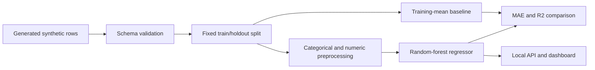

# Building Energy Regression Experiment

> **Evidence boundary:** this experiment fits a real scikit-learn model to 180 locally generated synthetic rows. It is not calibrated energy simulation, measured building-performance analysis, or professional engineering evidence.

This supporting portfolio project demonstrates a compact tabular regression workflow: deterministic data generation, preprocessing, model fitting, holdout evaluation against a simple baseline, API delivery, and an interactive dashboard.

## Current Evidence

| Check | Artifact-backed result |
| --- | ---: |
| Data | `180` synthetic rows |
| Fixed split | `135` train / `45` holdout rows |
| Random-forest MAE | `30.29` kWh/m2/year |
| Random-forest R2 | `0.579` |
| Training-mean baseline MAE | `42.50` kWh/m2/year |
| Training-mean baseline R2 | `-0.004` |
| MAE reduction relative to baseline | `0.287` |

The values above are generated from [`energy_eval_summary.json`](demo_outputs/energy_eval_summary.json), explained in [`energy_eval_report.md`](demo_outputs/energy_eval_report.md), and checked for documentation drift. The result only describes one fixed split of the bundled synthetic fixture.

## Reproduce

From the repository root:

```bash
python projects/building-energy-ml-pipeline/evaluate_model.py
python -m pytest tests/test_energy_model.py
```

The evaluation command regenerates both versioned files in [`demo_outputs/`](demo_outputs/).

## Implementation

- [`model.py`](src/building_energy_ml_pipeline/model.py) validates the schema, preprocesses categorical and numeric inputs, fits the random forest, and evaluates it.
- The holdout protocol uses a fixed `random_state=13` and compares the model with a `DummyRegressor(strategy="mean")` fitted on training targets only.
- [`api.py`](src/building_energy_ml_pipeline/api.py) exposes `/metrics` and `/predict` endpoints.
- [`app.py`](app.py) provides a Streamlit view over the same synthetic data and model code.
- [`MODEL_CARD.md`](MODEL_CARD.md) records intended use, evaluation scope, and misuse boundaries.

## Architecture



## Run The Interfaces

```bash
streamlit run projects/building-energy-ml-pipeline/app.py
python -m uvicorn building_energy_ml_pipeline.api:app --app-dir projects/building-energy-ml-pipeline/src --reload
```

The dashboard prediction is a demonstration inference from a model fitted to the full synthetic fixture. It is separate from the holdout metrics and must not be interpreted as a real building forecast.

## What The Evidence Supports

- A runnable preprocessing, regression, baseline-comparison, and serving path.
- Deterministic reproduction of the checked-in synthetic holdout result.
- Tests for training, prediction, missing fields, split accounting, baseline comparison, and artifact consistency.

## Limitations

- The target is generated from hand-authored feature relationships plus random noise.
- The evaluation uses one small fixed split and no cross-validation or external dataset.
- No weather file, utility bill, calibrated simulation engine, temporal behavior, uncertainty interval, or segment analysis is included.
- The model has not been checked for transfer to real buildings, climates, standards, or jurisdictions.
- Predictions must not be used for design, compliance, investment, sustainability reporting, or engineering decisions.

## Credible Next Steps

- Evaluate on a documented public building-energy benchmark with its license and provenance preserved.
- Add repeated cross-validation, residual slices, uncertainty intervals, and leakage checks.
- Compare additional transparent baselines before tuning model complexity.
- Validate the API schema and model artifact as a versioned contract.
