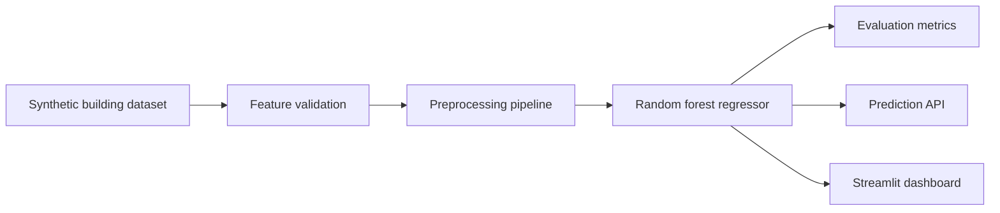

# Building Energy Prediction ML Pipeline

Machine-learning pipeline that predicts synthetic building energy-use intensity from architectural and operational features.

## Problem

Design teams benefit from early energy-risk signals, but performance analysis is often delayed until specialist simulation or late-stage review.

## Why It Matters

This project demonstrates classic ML skills in a built-environment setting: feature engineering, model training, evaluation, API delivery, and model-card documentation.

## Demo

```bash
streamlit run projects/building-energy-ml-pipeline/app.py
```

## Features

- Synthetic dataset generator
- Feature preprocessing for categorical and numeric inputs
- Random forest regression model
- Evaluation metrics and error framing
- FastAPI prediction endpoint
- Streamlit prediction dashboard
- Dockerfile and model card

## Tech Stack

Python, pandas, scikit-learn, FastAPI, Streamlit, pytest, Docker.

## Architecture



## How It Works

The model combines building type, floor area, glazing ratio, orientation, climate zone, occupancy, insulation score, HVAC type, and operating hours to estimate energy intensity.

## Example Outputs

```text
MAE: 19.4
R2: 0.82
Predicted energy intensity: 242.7 kWh/m2/year
```

## Run Locally

```bash
pip install -r requirements.txt
python scripts/generate_sample_data.py
streamlit run projects/building-energy-ml-pipeline/app.py
python -m uvicorn building_energy_ml_pipeline.api:app --app-dir projects/building-energy-ml-pipeline/src --reload
```

## Tests

```bash
pytest tests/test_energy_model.py
```

## Limitations

- Data is synthetic.
- Model is not calibrated to a real climate, standard, or simulation engine.
- Prediction uncertainty is not modeled.

## How I Would Improve This In Production

- Add ASHRAE/public benchmark datasets.
- Add uncertainty intervals and residual analysis charts.
- Add model registry and batch scoring.
- Add climate-file and utility-bill integrations.

## What This Proves To Employers

- Classic ML pipeline development
- Feature engineering and evaluation
- Local deployment with API and dashboard surfaces
- Responsible model documentation

## Engineering Notes

- The pipeline is structured like a small production ML service: generate/load data, engineer features, train, evaluate, serve, and document the model.
- Synthetic energy data makes the repository runnable without proprietary building datasets while preserving the shape of a real modeling workflow.
- The model card is part of the engineering deliverable because energy predictions can be misused if assumptions and limits are hidden.
- Production use would require climate data, utility data, occupancy features, uncertainty intervals, drift checks, and validation against public or client datasets.

## Technical Review Discussion Points

- Reviewers can inspect the full ML lifecycle from feature design to API serving.
- The feature set supports discussion of predictive building variables and proxy variables.
- The evaluation path extends beyond one score to residuals, uncertainty, and segment performance.
- The model card communicates risk, assumptions, and appropriate limits.
- The project connects ML engineering to energy analytics, sustainability, and building operations workflows.
