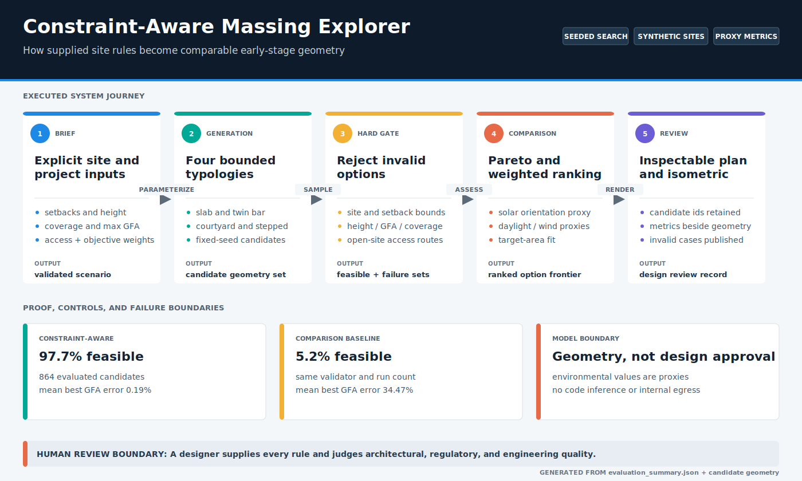
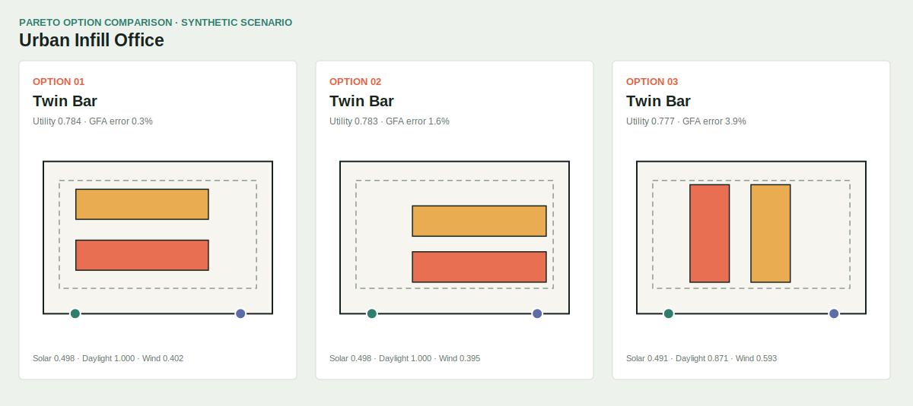

# Constraint-Aware Massing Explorer

Local parametric search for comparing early-stage building massing options against supplied site, height, coverage, maximum-GFA, access, and environmental proxy objectives. The project produces inspectable geometry and retains invalid candidates for failure analysis.

**Data status:** all bundled sites and constraints are synthetic. No customer, tender, parcel, or approval data is included.

[](demo_outputs/system_map.svg)

*Generated from the current evaluation artifact and candidate geometry. Hard constraints, soft proxies, baseline evidence, and the designer-review boundary remain distinct.*

## Implemented System

- Four geometric typologies: slab, twin bar, courtyard, and stepped massing.
- Seeded constraint-aware generation plus an unconstrained sampling baseline.
- Hard validation for site bounds, supplied setbacks, height, site coverage, maximum GFA, mass overlap, and open-site access paths.
- Transparent solar-orientation, exposed-perimeter daylight, wind-blockage, GFA-fit, and access-route proxies.
- Pareto filtering across five objectives plus editable weighted ranking.
- Plan and isometric SVGs generated from the actual candidate data.
- Repeatable three-site, three-seed benchmark with failure counts and baseline comparison.

## Evidence Snapshot

The checked-in evaluation is generated by `evaluate_massing.py`: three synthetic sites, three fixed seeds, and `96` candidates per mode per run (`864` candidates per mode in total). Exact run records remain in [`demo_outputs/evaluation_summary.json`](demo_outputs/evaluation_summary.json), with definitions and interpretation in [`EVAL.md`](EVAL.md).

| Metric | Constraint-aware | Unconstrained baseline |
| --- | ---: | ---: |
| Mean feasible-candidate rate | `0.977` | `0.052` |
| Mean best utility per run | `0.767` | `0.628` |
| Mean best target-GFA error | `0.19%` | `34.47%` |

The result shows that conditioning the sampler on supplied constraints improves this implementation's feasibility yield and target fit. It does not measure architectural quality. Twenty constraint-aware candidates exceeded maximum GFA and remain visible in the failure artifact.



## Run Locally

From the repository root:

```bash
pip install -r requirements.txt
python projects/constraint-aware-massing-explorer/evaluate_massing.py
streamlit run projects/constraint-aware-massing-explorer/app.py
```

Optional local API:

```bash
python -m uvicorn constraint_aware_massing_explorer.api:app --app-dir projects/constraint-aware-massing-explorer/src --reload
```

No paid API or model download is required.

## Tests

```bash
python -m pytest tests/test_massing_explorer.py
```

The tests cover scenario validation, deterministic generation, hard-constraint failures, access no-result handling, Pareto dominance, baseline comparison, SVG content, and deterministic artifact generation.

## Architecture

The generated system map above is the visual index. [`ARCHITECTURE.md`](ARCHITECTURE.md) documents the typed components, hard-versus-soft separation, access-path model, and reproducibility controls behind each stage.

## Limitations

- The system does not derive constraints from regulations. A designer must supply and verify every numeric rule.
- The access grid covers outdoor paths from ingress and egress points to a mass edge. It is not an internal egress, fire-safety, accessibility, or occupant-load model.
- Solar, daylight, and wind values are geometric proxies, not climate-based simulation, ray tracing, CFD, or calibrated performance predictions.
- Masses are axis-aligned rectangles on rectangular sites; there is no terrain, adjacent-building, view, acoustic, structure, facade, core, parking, unit-plan, or constructability model.
- Weighted utility reflects supplied preferences. It does not learn designer intent and does not establish an optimal or approvable design.
- The benchmark contains three synthetic sites and is useful for deterministic regression, not external generalization.

See [`LIMITATIONS.md`](LIMITATIONS.md) for failure modes and claim boundaries.

## Credible Next Steps

- Accept polygonal GIS/BIM site boundaries and adjacent-building context.
- Replace proxy objectives with validated solar/daylight and CFD adapters while preserving provenance.
- Add internal core, vertical-circulation, fire-compartment, and travel-distance models reviewed by qualified practitioners.
- Add uncertainty and sensitivity reports for rule changes and objective weights.
- Compare evolutionary search, constraint programming, and Bayesian optimization on a larger expert-reviewed benchmark.

## Reviewer Guide

1. Run the evaluation script and compare the constraint-aware and unconstrained feasible rates.
2. Inspect [`demo_outputs/failure_analysis.md`](demo_outputs/failure_analysis.md) to see which constraints still fail.
3. Open [`demo_outputs/top_options.json`](demo_outputs/top_options.json) and verify that the SVGs are derived from the same candidate IDs and metrics.
4. Read [`EVAL.md`](EVAL.md) before interpreting the environmental scores.
