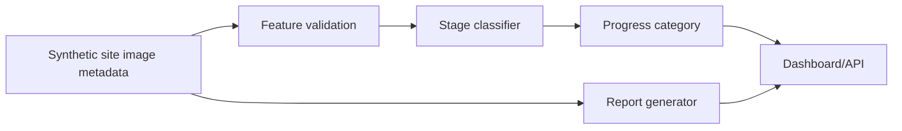

# Construction Progress Computer Vision Tracker

Computer vision-style progress tracker that classifies synthetic construction site observations into delivery stages and generates a concise site report.

## Problem

Construction teams need faster ways to translate site imagery into progress status, schedule risk, and stakeholder updates.

## Why It Matters

Even before production image models are available, AI engineers can prototype the surrounding workflow: metadata ingestion, classification, evaluation, API delivery, and reporting.

## Demo

```bash
streamlit run projects/construction-progress-cv/app.py
```

## Features

- Synthetic image metadata generator
- Progress-stage classifier
- Holdout evaluation report
- Site progress summary generator
- FastAPI endpoint for `/predict` and `/summary`
- Streamlit dashboard for data inspection and manual predictions

## Tech Stack

Python, pandas, scikit-learn, FastAPI, Streamlit, pytest.

## Architecture



## How It Works

The demo uses progress percentages and site context as stand-ins for detections from site photos. In production, these features could come from object detection, segmentation, photogrammetry, or manual QA annotations.

## Example Output

```text
Week 30 is classified as handover. Strongest signal: foundation_pct. Risk notes: no major synthetic risk flags.
```

## Run Locally

```bash
pip install -r requirements.txt
python scripts/generate_sample_data.py
streamlit run projects/construction-progress-cv/app.py
python -m uvicorn construction_progress_cv.api:app --app-dir projects/construction-progress-cv/src --reload
```

## Tests

```bash
pytest
```

## Limitations

- Uses synthetic metadata rather than real images.
- The classifier is intentionally lightweight.
- Real deployment would need camera calibration, labeling strategy, and privacy controls.

## How I Would Improve This In Production

- Add object detection for structural elements, PPE, and material stockpiles.
- Add schedule-baseline comparison.
- Add confidence calibration and human review queues.

## What This Proves To Employers

- Applied computer vision workflow design
- ML pipeline and evaluation basics
- Reporting automation for construction stakeholders
- Ability to separate prototype data from production claims

## Engineering Notes

- The current system uses synthetic progress metadata so the workflow can be reviewed without private site photos or labeling dependencies.
- The classifier is intentionally lightweight, but the app/API boundary mirrors a production CV pipeline: ingest, classify, summarize, and report.
- The report layer is a key product feature because construction teams need digestible status signals, not just raw predictions.
- A production version would add image/video ingestion, object detection, calibration across camera locations, privacy review, and schedule-baseline integration.

## Technical Review Discussion Points

- Reviewers can distinguish the current metadata prototype from a full visual progress model.
- The project supports discussion of site-image labeling, milestone definitions, and progress taxonomy design.
- Confidence thresholds and human review are the key risk controls for operational use.
- The FastAPI and Streamlit split demonstrates separate service and demo surfaces.
- The project connects ML output to construction stakeholder needs: schedule, safety, evidence, and reporting.
