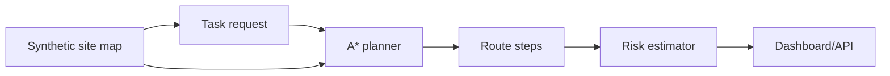

# Construction Robot Task Planner

Embodied AI planning demo that routes construction robots across a synthetic site map while accounting for obstacles, restricted zones, slow zones, payload, and battery margin.

## Problem

Construction robots need task plans that respect dynamic site constraints, human activity zones, payload limits, and battery state. Planning has to be explainable enough for site teams to trust and override.

## Why It Matters

Robotics in construction is an embodied AI problem: perception, planning, navigation, human-robot interaction, and operational constraints have to work together in messy physical environments.

## Demo

```bash
streamlit run projects/construction-robot-task-planner/app.py
```

## Features

- Synthetic construction site map
- A* grid planner
- Obstacle avoidance
- Slow-zone and restricted-zone cost handling
- Payload and battery risk estimate
- FastAPI `/tasks` and `/plan` endpoints
- Streamlit route visualization

## Tech Stack

Python, FastAPI, Streamlit, pytest.

## Architecture



## How It Works

The planner models the construction site as a grid. Obstacles are blocked, slow zones carry a moderate cost, and restricted zones carry a high cost. The output includes route steps and an operational risk estimate.

## Example Outputs

```text
Task: MAT-01
Path length: 18
Risks: no major synthetic planning risks detected
Action examples: start, move, slow_move, arrive
```

## Run Locally

```bash
pip install -r requirements.txt
python scripts/generate_sample_data.py
streamlit run projects/construction-robot-task-planner/app.py
python -m uvicorn construction_robot_task_planner.api:app --app-dir projects/construction-robot-task-planner/src --reload
```

## Tests

```bash
pytest tests/test_robot_task_planner.py
```

## Limitations

- Uses a grid map, not real SLAM, occupancy maps, or robot kinematics.
- Does not integrate live perception, ROS, digital twins, or fleet orchestration.
- Synthetic safety estimates are not a substitute for site-specific robotics safety engineering.

## How I Would Improve This In Production

- Integrate ROS 2 navigation stacks and site-map updates.
- Add dynamic obstacles from perception and worker tracking.
- Add task scheduling across robot fleets.
- Add human approval workflows for restricted-zone crossings.
- Use simulation before deployment on physical hardware.

## What This Proves To Employers

- Embodied AI planning fundamentals
- Robotics workflow thinking for construction sites
- Ability to model safety, navigation, and operations constraints
- Practical software packaging around robotics concepts

## Engineering Notes

- The planner models construction tasks as constrained action selection: battery, payload, route risk, restricted zones, and task priority all affect decisions.
- The grid abstraction is intentionally simple so the safety and planning logic can be reviewed without hiding behind a robotics stack.
- This is an embodied AI project because it connects environment state, action feasibility, and task goals rather than only producing text.
- Production use would require ROS 2, navigation stacks, site maps, robot kinematics, perception feeds, simulation validation, and human approval workflows.

## Technical Review Discussion Points

- Reviewers can assess how construction robotics differs from generic warehouse navigation.
- Task feasibility changes with payload, obstacles, battery state, and restricted zones.
- Simulation and safety gates are treated as prerequisites before any hardware deployment.
- VLA-style language goals are identified as a future path for mapping site instructions to robot actions.
- The project bridges AI planning, robotics operations, and construction domain knowledge.
