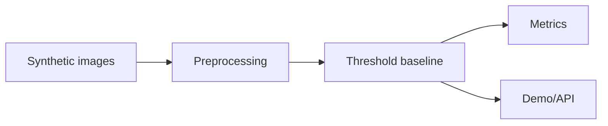

# Vision Baseline / Threshold Model Lab

Computer-vision defect detection baseline using synthetic image data, a deterministic threshold model, metrics, Streamlit demo, and FastAPI metrics endpoint. This is a classical baseline lab, not a neural-network or deep-learning implementation.

## Problem

Vision systems need dataset generation, preprocessing, evaluation, and deployment surfaces before model complexity matters. This project intentionally starts with a transparent threshold baseline.

## Demo

```bash
streamlit run projects/deep-learning-vision-lab/app.py
```

## Features

- Synthetic defect dataset generator
- Scratch/crack/OK classes
- Classical brightness/diagonal threshold classifier
- Accuracy and macro-F1 metrics
- Example predictions
- FastAPI `/metrics` endpoint

## Tech Stack

Python, NumPy, scikit-learn metrics, FastAPI, Streamlit. PyTorch training can be added without changing the project shape.

## Architecture



## Limitations

- Synthetic image data and simple threshold baseline.
- No CNN, ViT, U-Net, or learned neural-network weights in the current implementation.
- No real manufacturing images or production inspection claims.

## Deployment-Relevant Extensions

- Add PyTorch CNN/U-Net training, confusion matrices, real defect data, and latency benchmarks.

## TODO: Real CNN Baseline

- Add a small PyTorch CNN trained on the synthetic defect dataset.
- Compare threshold baseline versus CNN metrics on a fixed train/test split.
- Save learned weights, confusion matrix, and model-card notes for the CNN path.

## Reviewer Signal

Computer-vision baseline design, dataset generation, evaluation discipline, and inference packaging. The current model is deliberately classical and should not be read as evidence of trained deep-learning weights.

## Engineering Notes

- The lab is shaped around a future deep learning workflow: dataset manifest, preprocessing, metrics, model card, API, and demo.
- Synthetic data keeps the project lightweight while allowing the repository to show evaluation and packaging discipline.
- The threshold baseline is deliberately simple so the model interface can be replaced by PyTorch training without restructuring the app.
- Production use would require real labeled images, CNN/ViT training, augmentation, calibration, latency profiling, and error analysis by defect type.

## Technical Review Discussion Points

- Reviewers can distinguish baseline workflow competence from production inspection accuracy claims.
- The project supports discussion of collecting, labeling, splitting, and auditing a real vision dataset.
- The metrics path extends beyond accuracy to error analysis and model behavior.
- The model card documents assumptions, limitations, and failure modes.
- PyTorch training can slot into the existing architecture without changing the demo/API shape.

