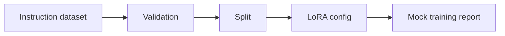

# Fine-Tuning and LoRA Lab

Compute-aware fine-tuning workflow for support-ticket classification with dataset generation, validation, split logic, LoRA config, mock training, and evaluation report.

## Problem

Fine-tuning projects often fail before training because datasets, validation, compute assumptions, and evaluation are unclear.

## Demo

```bash
streamlit run projects/fine-tuning-lora-lab/app.py
```

## Features

- Instruction dataset generator
- Dataset validation
- Train/validation split
- LoRA config structure
- Mock trainer requiring no GPU
- Clear path for real GPU training

## Tech Stack

Python, dataclasses, Streamlit, pytest, Hugging Face-compatible workflow structure.

## Architecture



## Limitations

- No real heavy fine-tuning is run locally.
- Mock trainer demonstrates workflow shape, not model adaptation performance.

## How I Would Improve This In Production

- Add tokenizer, PEFT/LoRA trainer, GPU instructions, model registry, and held-out evaluation.

## What This Proves To Employers

Fine-tuning workflow knowledge, dataset preparation, model adaptation planning, evaluation discipline, and responsible compute-aware engineering.

## Engineering Notes

- The lab models the fine-tuning lifecycle: dataset validation, split planning, LoRA configuration, mock training report, and model-card style documentation.
- Mock training keeps the project runnable on a normal laptop while showing where PEFT/LoRA training would be introduced.
- The workflow emphasizes dataset quality and evaluation planning because fine-tuning often fails from weak data rather than code alone.
- Production use would require tokenizer/model loading, GPU training, experiment tracking, held-out evals, artifact storage, and safety review.

## Technical Review Discussion Points

- Reviewers can assess when prompting, RAG, fine-tuning, or LoRA would be the right adaptation strategy.
- Dataset formatting, deduplication, train/validation splits, and leakage risks are treated as first-class concerns.
- The LoRA configuration fields expose key adaptation tradeoffs.
- The documented evaluation plan is required before any fine-tuned model should ship.
- Local mock training demonstrates workflow design, not model performance.

