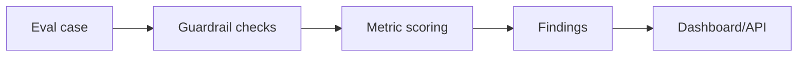

# Prompt and Output Validation Checks

Small deterministic check library for prompt-injection patterns, structured-output validation, citation coverage, and regression-style cases. It is not a comprehensive guardrail or safety platform.

## Problem

Model-integrated applications need tests for structured behavior and known failure patterns, not only prompts.

## Demo

```bash
streamlit run projects/llm-evals-guardrails-platform/app.py
```

## Features

- Prompt injection detector
- JSON/structured-output validator
- Citation coverage score
- Eval case schema
- Dashboard and FastAPI `/evaluate` endpoint
- Local sample eval cases

## Tech Stack

Python, Streamlit, FastAPI, Pydantic-style schemas, pytest.

## Architecture



## Tests

```bash
python -m pytest tests/test_general_ai_projects.py -k guardrails
```

## Limitations

- Rules are transparent baselines.
- Does not replace human review or full red-team evaluation.

## Deployment-Relevant Extensions

- Add model-graded evals, prompt version registry, SQLite persistence, and CI regression gates.

## Evidence

Deterministic regression checks for known prompt patterns, required JSON fields, and citation presence. These checks expose inspectable failures but do not establish model safety or security.

## Implementation Notes

- The check library treats evals as a repeatable engineering workflow: cases, checks, findings, metrics, and dashboard/API outputs.
- Transparent guardrails are used first so failures can be inspected before adding model-graded evals.
- The scope covers practical LLM risks: prompt injection, unsafe content, missing citations, and invalid structured outputs.
- Production use would require prompt/version registries, persisted eval history, CI regression gates, red-team datasets, and human review workflows.

## Design Decisions

- The regression cases show why LLM checks should run before and after prompt or model changes.
- The project distinguishes deterministic checks from model-graded evaluation.
- Prompt injection and schema failures are represented as inspectable eval cases.
- The workflow can become a CI gate for an LLM application.
- Guardrails are framed as risk reduction, not a guarantee of perfect safety.

