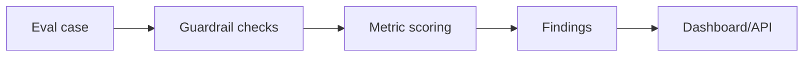

# LLM Evals and Guardrails Platform

Lightweight LLMOps platform for prompt-injection detection, structured-output validation, citation coverage checks, and regression-style evaluation.

## Problem

Production AI systems need tests for reliability, safety, and structured behavior, not only prompts.

## Demo

```bash
streamlit run projects/llm-evals-guardrails-platform/app.py
```

## Features

- Prompt injection detector
- JSON/structured-output validator
- Citation coverage score
- Eval case schema
- Dashboard and FastAPI `/evaluate` endpoint
- Local sample eval cases

## Tech Stack

Python, Streamlit, FastAPI, Pydantic-style schemas, pytest.

## Architecture



## Limitations

- Rules are transparent baselines.
- Does not replace human review or full red-team evaluation.

## How I Would Improve This In Production

- Add model-graded evals, prompt version registry, SQLite persistence, and CI regression gates.

## What This Proves To Employers

LLMOps, guardrails, prompt-injection awareness, structured-output validation, and responsible AI engineering.

## Engineering Notes

- The platform treats evals as a repeatable engineering workflow: cases, checks, findings, metrics, and dashboard/API outputs.
- Transparent guardrails are used first so failures can be inspected before adding model-graded evals.
- The scope covers practical LLM risks: prompt injection, unsafe content, missing citations, and invalid structured outputs.
- Production use would require prompt/version registries, persisted eval history, CI regression gates, red-team datasets, and human review workflows.

## Technical Review Discussion Points

- Reviewers can assess why LLM evals should run before and after prompt/model changes.
- The project distinguishes deterministic checks from model-graded evaluation.
- Prompt injection and schema failures are represented as inspectable eval cases.
- The workflow can become a CI gate for an LLM application.
- Guardrails are framed as risk reduction, not a guarantee of perfect safety.

