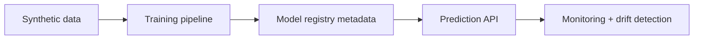

# MLOps Model Serving and Monitoring Platform

Synthetic churn-risk MLOps demo with model training, prediction schema, FastAPI serving, inference-style validation, drift detection, and Streamlit monitoring.

## Problem

ML systems need serving, schema checks, logging, drift detection, and model lifecycle thinking beyond notebooks.

## Demo

```bash
streamlit run projects/mlops-model-serving-monitoring/app.py
```

## Features

- Synthetic churn dataset
- scikit-learn training pipeline
- FastAPI `/predict` and `/metrics`
- Drift detection
- Model version metadata
- Dockerfile

## Tech Stack

Python, pandas, scikit-learn, FastAPI, Streamlit, Docker, pytest.

## Architecture



## Limitations

- Synthetic customer data only.
- Not a real financial or customer-retention decision system.

## How I Would Improve This In Production

- Add SQLite inference logging, model registry artifacts, MLflow-compatible metadata, and alerting.

## What This Proves To Employers

MLOps, model serving, monitoring, drift detection, API engineering, and production ML thinking.

## Engineering Notes

- The project demonstrates the operational side of ML: training artifact, version metadata, serving API, metrics, drift checks, and Docker packaging.
- Synthetic churn data keeps setup simple while preserving the same serving and monitoring patterns used in real systems.
- Drift detection is intentionally lightweight and explainable so the monitoring signal can be discussed without external infrastructure.
- Production use would add a persistent model registry, inference logging, feature store or batch pipelines, alerting, and retraining workflows.

## Technical Review Discussion Points

- Reviewers can trace the path from training data to deployed prediction endpoint.
- Schema validation and model metadata are shown as core ML serving requirements.
- Drift detection is documented with its uses and limits.
- MLflow, database-backed logs, and production alerts are clear production extensions.
- The project demonstrates reliable ML operations rather than one-off notebook modeling.

