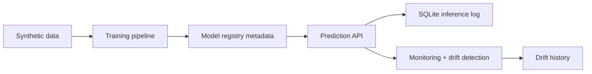

# Local Model Serving and Monitoring Scaffold

Local synthetic churn-risk scaffold with model training, prediction schemas, FastAPI serving, model artifact saving, SQLite inference logging, drift-history persistence, and Streamlit monitoring. It does not represent a deployed MLOps platform.

Supporting review project for local MLOps review.

## Problem

ML systems need serving, schema checks, logging, drift detection, and model lifecycle thinking beyond notebooks.

## Demo

```bash
streamlit run projects/mlops-model-serving-monitoring/app.py
```

Reviewer artifacts:

- [ARCHITECTURE.md](ARCHITECTURE.md)
- [EVAL.md](EVAL.md)
- [MONITORING.md](MONITORING.md)
- [LIMITATIONS.md](LIMITATIONS.md)
- [CASE_STUDY.md](CASE_STUDY.md)
- [demo_outputs/sample_monitoring_report.json](demo_outputs/sample_monitoring_report.json)
- [demo_outputs/model_eval_report.md](demo_outputs/model_eval_report.md)

## Features

- Synthetic churn dataset
- scikit-learn training pipeline
- FastAPI `/predict`, `/metrics`, `/health`, and `/model-info`
- SQLite prediction log and drift history
- Drift detection with mean-shift and PSI-style scores
- Monitoring report with volume, latency, errors, warnings, and drift summary
- Model artifact and version metadata with feature schema, dataset info, and git commit when available
- Dockerfile

## Tech Stack

Python, pandas, scikit-learn, FastAPI, Streamlit, SQLite, joblib, Docker, pytest.

## Architecture



## Limitations

- Synthetic customer data only.
- Not a real financial or customer-retention decision system.
- Local SQLite and artifact files are development scaffolding, not production infrastructure.

## Deployment-Relevant Extensions

- Add MLflow-compatible registry, production alerting, delayed-label monitoring, and retraining workflows.

## Reviewer Signal

MLOps, model serving, artifact management, inference logging, monitoring, drift detection, API engineering, and production-aware ML thinking.

## Engineering Notes

- The project demonstrates the operational side of ML: training artifact, version metadata, serving API, SQLite inference logs, metrics, drift checks, drift history, and Docker packaging.
- Synthetic churn data keeps setup simple while preserving the same serving and monitoring patterns used in real systems.
- Drift detection is intentionally lightweight and explainable so the monitoring signal can be discussed without external infrastructure.
- Production use would add an MLflow-compatible model registry, feature store or batch pipelines, alerting, delayed-label feedback, and retraining workflows.

## Technical Review Discussion Points

- Reviewers can trace the path from training data to a local prediction endpoint.
- Schema validation, model metadata, and prediction logging are shown as core ML serving requirements.
- Drift detection is documented with its uses and limits.
- MLflow, delayed labels, retraining triggers, and production alerts are clear production extensions.
- The project demonstrates reliable ML operations rather than one-off notebook modeling.

