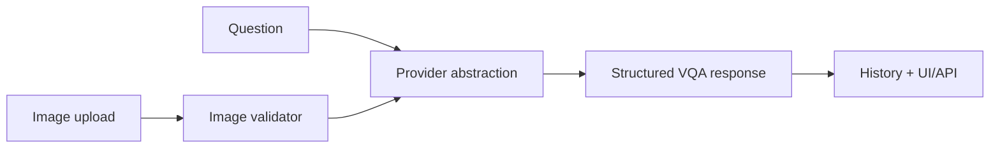

# Visual QA Provider Contract

Provider-interface prototype for image validation, image-plus-question request construction, structured response parsing, uncertainty fields, and failure handling. The default local path is a zero-confidence mock that deliberately leaves semantic fields empty. An optional OpenAI-compatible hosted provider can make a real image request when separately configured.

Experiment for reviewing multimodal product contracts. It does not demonstrate a local VLM, visual reasoning, OCR, or defect detection.

## Problem

Applications that call vision-capable models still need image validation, request construction, response schemas, uncertainty handling, and explicit fallback behavior. This project isolates those interface concerns without treating a mock as model capability.

## Demo

```bash
streamlit run projects/multimodal-vlm-visual-qa/app.py
```

Regenerate the checked-in mock contract output:

```bash
python projects/multimodal-vlm-visual-qa/generate_contract_artifact.py
```

Evidence artifacts:

- [LIMITATIONS.md](LIMITATIONS.md)
- [demo_outputs/mock_vqa_output.json](demo_outputs/mock_vqa_output.json)
- [demo_outputs/failure_example.md](demo_outputs/failure_example.md)

## Features

- Image upload and question input
- Zero-confidence mock provider plus optional OpenAI-compatible hosted provider
- Tested prompt construction contract
- Structured JSON extraction schema
- Confidence and uncertainty fields
- History view
- Evaluation examples and failure-case validation

## Tech Stack

Python, Streamlit, FastAPI, Pydantic, provider abstraction, stdlib HTTP client.

## Architecture



## Tests

```bash
python -m pytest tests/test_general_ai_projects.py -k vlm
```

## Limitations

- Mock mode validates file signatures and response contracts but performs no visual inference.
- Hosted provider mode requires `VLM_PROVIDER=openai`, `OPENAI_API_KEY`, and access to a vision-capable model.
- No local vision model implementation is exposed.

## Credible Next Steps

- Add BLIP/Qwen/SigLIP local provider implementations.
- Add OCR, bounding boxes, and image-region grounding.
- Add eval sets for visual hallucination and extraction accuracy.

## Evidence

Multimodal provider integration, structured response validation, image request construction, and an explicit distinction between interface testing and model capability.

## Implementation Notes

- The provider abstraction separates workflow validation from the optional hosted model implementation.
- The OpenAI-compatible provider builds a real image-plus-text chat-completions request and parses a schema-constrained JSON response when credentials are present.
- Structured responses include confidence, uncertainty, and evidence fields to avoid turning visual QA into untraceable free text.
- Mock mode validates uploads, prompts, schemas, and UI/API behavior while returning zero confidence and no semantic detections.
- Production use would require OCR/region grounding, benchmark image sets, latency tests, and visual hallucination evaluation.

## Design Decisions

- The request and response contracts make the role of schema design in multimodal integrations explicit.
- The project distinguishes captioning, VQA, OCR, and structured visual extraction.
- The evaluation path should include visual hallucination and abstention behavior.
- The provider boundary currently supports an honest mock and an optional hosted implementation; no local model is claimed.
- Mock mode is clearly documented as workflow validation, not real visual reasoning.

