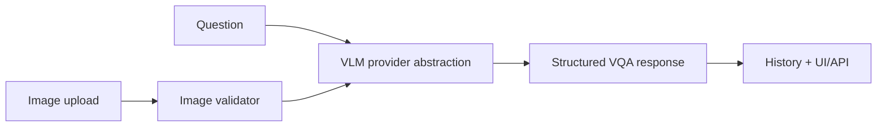

# Multimodal VLM Visual QA Assistant

Visual question-answering assistant for image QA, screenshot explanation, defect description, and image-to-structured-JSON extraction. It runs locally in mock mode without API keys and can optionally call an OpenAI-compatible hosted vision provider.

Supporting flagship project for multimodal workflow review. Mock mode validates the product boundary; it does not perform real visual reasoning.

## Problem

Teams increasingly need products that turn visual inputs into reliable answers and structured records. The hard part is not only model access; it is validation, uncertainty, schemas, history, and fallbacks.

## Demo

```bash
streamlit run projects/multimodal-vlm-visual-qa/app.py
```

Reviewer artifacts:

- [LIMITATIONS.md](LIMITATIONS.md)
- [demo_outputs/mock_vqa_output.json](demo_outputs/mock_vqa_output.json)
- [demo_outputs/failure_example.md](demo_outputs/failure_example.md)

## Features

- Image upload and question input
- Mock VLM provider plus optional OpenAI-compatible hosted provider
- Tested prompt construction contract
- Structured JSON extraction schema
- Confidence and uncertainty fields
- History view
- Evaluation examples and failure-case validation

## Tech Stack

Python, Streamlit, FastAPI, Pydantic, mock provider abstraction, stdlib HTTP client.

## Architecture



## Limitations

- Mock mode validates workflow but does not perform true visual reasoning.
- Hosted provider mode requires `VLM_PROVIDER=openai`, `OPENAI_API_KEY`, and access to a vision-capable model.
- The local VLM provider remains an interface reserved for future on-device models.

## How I Would Improve This In Production

- Add BLIP/Qwen/SigLIP local provider implementations.
- Add OCR, bounding boxes, and image-region grounding.
- Add eval sets for visual hallucination and extraction accuracy.

## What This Proves To Employers

VLM engineering, multimodal product thinking, structured AI outputs, image workflow validation, optional hosted-provider integration, and honest mock-provider design.

## Engineering Notes

- The provider abstraction separates the product workflow from the model implementation, so mock, local, and hosted VLM backends can share one schema.
- The OpenAI-compatible provider builds a real image-plus-text chat-completions request and parses a schema-constrained JSON response when credentials are present.
- Structured responses include confidence, uncertainty, and evidence fields to avoid turning visual QA into untraceable free text.
- Mock mode validates uploads, prompts, schemas, and UI/API behavior without claiming true visual reasoning.
- Production use would require OCR/region grounding, benchmark image sets, latency tests, and visual hallucination evaluation.

## Technical Review Discussion Points

- Reviewers can assess why schema design matters for multimodal AI products.
- The project distinguishes captioning, VQA, OCR, and structured visual extraction.
- The evaluation path should include visual hallucination and abstention behavior.
- The provider boundary supports hosted, local, and mock model implementations.
- Mock mode is clearly documented as workflow validation, not real visual reasoning.

