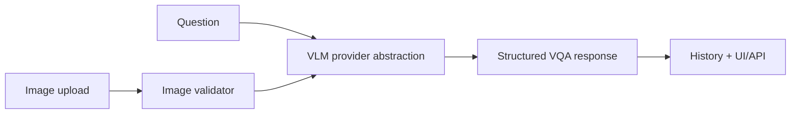

# Multimodal VLM Visual QA Assistant

Visual question-answering assistant for image QA, screenshot explanation, defect description, and image-to-structured-JSON extraction. It runs locally in mock mode without API keys.

## Problem

Teams increasingly need products that turn visual inputs into reliable answers and structured records. The hard part is not only model access; it is validation, uncertainty, schemas, history, and fallbacks.

## Demo

```bash
streamlit run projects/multimodal-vlm-visual-qa/app.py
```

## Features

- Image upload and question input
- Mock VLM provider plus local/OpenAI-compatible placeholders
- Structured JSON extraction schema
- Confidence and uncertainty fields
- History view
- Evaluation examples and failure-case validation

## Tech Stack

Python, Streamlit, FastAPI, Pydantic, mock provider abstraction.

## Architecture



## Limitations

- Mock mode validates workflow but does not perform true visual reasoning.
- Local VLM and hosted VLM providers are placeholders for future integration.

## How I Would Improve This In Production

- Add BLIP/Qwen/SigLIP provider implementations.
- Add OCR, bounding boxes, and image-region grounding.
- Add eval sets for visual hallucination and extraction accuracy.

## What This Proves To Employers

VLM engineering, multimodal product thinking, structured AI outputs, image workflow validation, and honest mock-provider design.

## Engineering Notes

- The provider abstraction separates the product workflow from the model implementation, so mock, local, and hosted VLM backends can share one schema.
- Structured responses include confidence, uncertainty, and evidence fields to avoid turning visual QA into untraceable free text.
- Mock mode validates uploads, prompts, schemas, and UI/API behavior without claiming true visual reasoning.
- Production use would require real VLM integration, OCR/region grounding, benchmark image sets, latency tests, and visual hallucination evaluation.

## Interview Talking Points

- Explain why schema design matters for multimodal AI products.
- Discuss the difference between captioning, VQA, OCR, and structured visual extraction.
- Walk through how you would test visual hallucination and abstention behavior.
- Describe how the provider boundary supports hosted and local models.
- Be explicit about what mock mode proves and what it does not prove.

