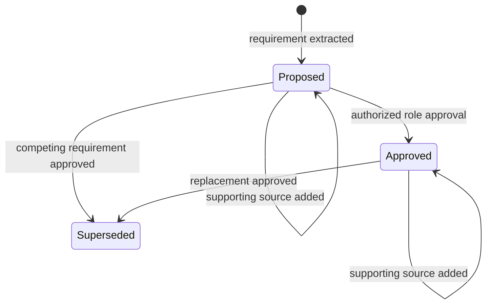

# Architecture

## Design Goal

The system treats project communication as evidence, not as permission to write authoritative specifications. Messages may propose requirements. Only authorized approval events can move a requirement into the draft clause set.

## Conversation Model

The Streamlit interface presents one shared project conversation. Each message records an author, project role, sequence number, immutable message ID, and data-status label before extraction runs. Client and team messages use the same event path; role changes affect approval authority, not whether a message is retained. This is a local single-session demonstration, not a multi-user messaging service, authenticated collaboration platform, or open-domain chatbot.

## Components

| Component | Responsibility | Boundary |
| --- | --- | --- |
| `models.py` | Messages, requirements, conflicts, clauses, drafts, and snapshots. | Typed local records; no external identity. |
| `extractor.py` | Documented deterministic phrase/value extraction plus question and historical-context abstention. | Named variants only; no open-domain language understanding. |
| `engine.py` | Requirement lifecycle, conflicts, role gates, clause generation, and completeness. | No autonomous approval or professional judgment. |
| `store.py` | Append-only SQLite audit events. | Local trace, not tamper-proof or multi-user infrastructure. |
| `evaluation.py` | Workflow regression plus direct/paraphrase/negative language stress scoring and evidence artifacts. | Repository-authored labels only; stress cases are not blinded. |
| `rendering.py` | Trace SVG generated from messages, ledger records, and clauses. | Explanatory output, not a project document. |
| `app.py` | Conversation, ledger, approval action, draft, and audit views. | Local single-session interface. |

## State Transitions

## Conflict Handling

When active requirements share a key but have different normalized values, the engine creates an open conflict. It retains both records. Approval of one value by an authorized role supersedes competing values and records the resolution in the audit trace. Different keys are not assumed to conflict.

## Approval Matrix

| Role | Approval categories |
| --- | --- |
| Client | Programme, budget, schedule, site, access |
| Architect | Programme, design, access, compliance, coordination |
| Structural engineer | Structure |
| MEP engineer | Performance, building services |
| Quantity surveyor | Budget, cost |
| Project manager | Schedule, coordination |
| Contractor | None in the bundled matrix |

The matrix is illustrative and project-specific. A deployed workflow would require a configurable responsibility matrix, authenticated identities, and formal delegated authority.

## Draft Boundary

Only `approved` requirements become clauses. Proposed requirements and open conflicts appear under open decisions. Every clause carries the requirement ID, source message IDs, and approver role. The draft always states that human review is required.
