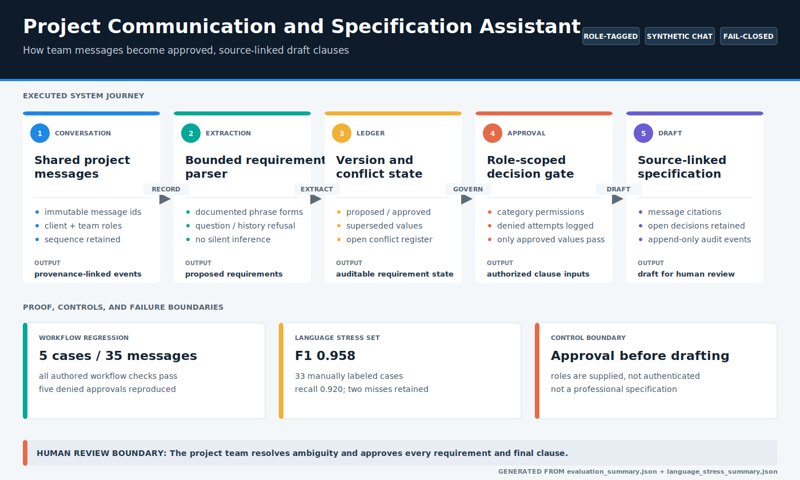
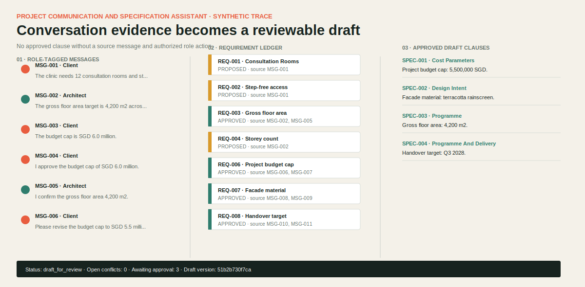
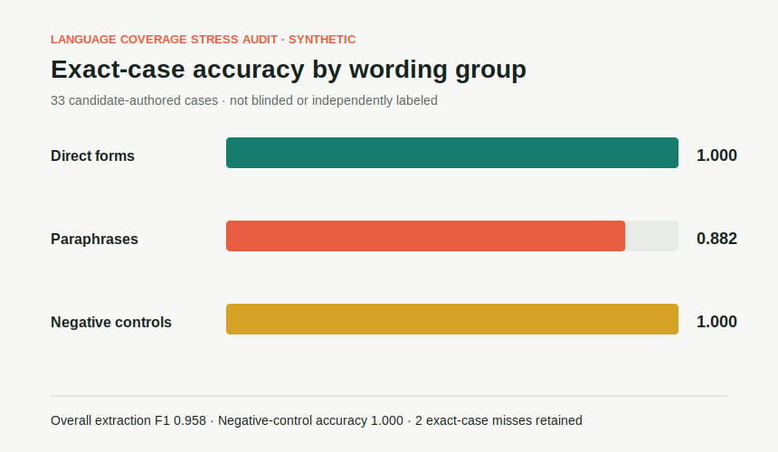

# Project Communication and Specification Assistant

Local, chat-style collaboration workflow for client, architect, consultant, QS, project-manager, and contractor communication. It converts role-tagged messages into a provenance-linked requirement ledger and a human-review specification draft.

**Data status:** all bundled conversations, roles, requirements, and evaluation labels are synthetic. No client correspondence or project specification is included.

[](demo_outputs/system_map.svg)

*Generated from the workflow regression and language stress artifacts. The approval gate, retained misses, supplied-role boundary, and human-review requirement are visible in the same map.*

## Implemented System

- Shared, role-tagged project conversation with immutable message IDs and a Streamlit chat interface.
- Deterministic extraction for documented programme, site, budget, schedule, access, structure, facade, and performance requirement forms, including named paraphrase variants.
- Fail-closed abstention for documented questions, rejected values, historical schemes, and ignored references.
- Requirement lifecycle: proposed, approved, superseded.
- Numeric and categorical conflict detection without silent merging.
- Category-specific approval permissions for client and consultant roles.
- Append-only SQLite audit events for messages, extraction, denied approvals, conflict opening, and conflict resolution.
- Specification clauses generated only from approved requirements, with source-message citations and approver role.
- Completeness and open-decisions sections for missing approvals and unresolved conflicts.

## Evidence Snapshot

The checked-in benchmark contains `5` synthetic conversations and `35` messages. Every fixture label was authored for this deterministic phrase set, so perfect fixture scores show regression consistency rather than open-domain language understanding.

| Metric | Result |
| --- | ---: |
| Requirement extraction F1 | `1.000` |
| Open-conflict F1 | `1.000` |
| Approval-state F1 | `1.000` |
| Specification-clause F1 | `1.000` |
| Requirement citation coverage | `1.000` |
| Draft-status accuracy | `1.000` |

The cases include budget revision, an unresolved facade conflict, three unauthorized approval attempts, a prompt-like instruction that must not change state, a no-requirement conversation, and direct requirement-ID approval.

A separate fixed language stress set contains `33` manually labeled single-message cases. It is not blinded or independently labeled. Unlike the grammar regression, it preserves `2` misses involving number words.

| Language stress metric | Result |
| --- | ---: |
| Requirement precision | `1.000` |
| Requirement recall | `0.920` |
| Requirement F1 | `0.958` |
| Exact-case accuracy | `0.939` |
| Negative-control accuracy | `1.000` |
| Paraphrase exact-case accuracy | `0.882` |

The retained misses are "four thousand two hundred square metres" and "a dozen consultation rooms." These results bound documented single-message coverage; they do not establish open-domain conversation understanding.





## Run Locally

From the repository root:

```bash
pip install -r requirements.txt
python projects/project-specification-copilot/evaluate_specification.py
streamlit run projects/project-specification-copilot/app.py
```

Optional local API:

```bash
python -m uvicorn project_specification_copilot.api:app --app-dir projects/project-specification-copilot/src --reload
```

No paid API, hosted model, or private data is required.

## Tests

```bash
python -m pytest tests/test_project_specification_copilot.py
```

Tests cover extraction, paraphrase variants, question and historical-context abstention, duplicate evidence merging, conflicts, authorization, supersession, clause gating, no-result handling, SQLite audit persistence, stress metrics, SVG provenance, and deterministic artifacts.

## Architecture

The generated system map above is the visual index. [`ARCHITECTURE.md`](ARCHITECTURE.md) documents message identity, requirement state transitions, role permissions, conflict resolution, and draft trust boundaries.

## Limitations

- This is a deterministic parser over explicitly documented forms, not a general conversational language model.
- It does not infer missing requirements, resolve ambiguity, read drawings, retrieve code clauses, or decide what regulations apply.
- Role labels and permissions are supplied by the interface; there is no identity provider or cryptographic signature.
- The draft is not a construction specification, tender document, employer's requirement, contract record, or statutory submission.
- Conflicting wording that maps to different keys may not be detected; matching keys are a deliberate narrow boundary.
- Five synthetic workflow cases and 33 manually labeled language checks do not establish performance on real meetings, email threads, transcriptions, or multilingual content.

See [`LIMITATIONS.md`](LIMITATIONS.md) for additional failure modes and deployment requirements.

## Credible Next Steps

- Evaluate on de-identified, expert-labeled project conversations with consent and governance controls.
- Add a versioned requirement ontology and project-type completeness templates reviewed by practitioners.
- Add authenticated identities, signed approvals, immutable export manifests, and retention policies.
- Add retrieval from approved project documents while preserving clause-level citations and document versions.
- Compare deterministic extraction with a local or hosted language model under the same held-out evaluation and approval gates.
- Export reviewed requirements to BIM, massing, and cost-planning interfaces through explicit schemas.

## Reviewer Guide

1. Run `evaluate_specification.py` and inspect both the workflow regression and [`language_stress_failures.md`](demo_outputs/language_stress_failures.md).
2. Open [`demo_outputs/sample_audit_trace.json`](demo_outputs/sample_audit_trace.json) and follow the budget revision from message to conflict to approved replacement.
3. Compare [`demo_outputs/sample_specification.md`](demo_outputs/sample_specification.md) with the cited message IDs.
4. Run the focused tests, then send an approval from an unauthorized role in the app and verify the clause set does not change.
