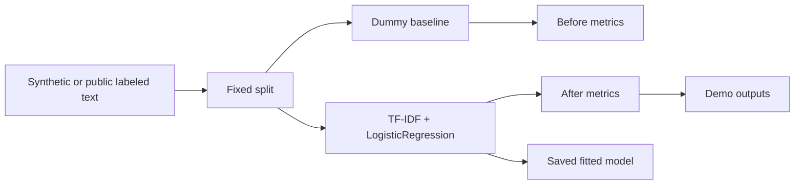

# Real Model Fine-Tune Lab

Small text-classification project that actually fits model weights locally. It now has two training paths: a fast synthetic portfolio-task classifier and a larger locally bundled UCI SMS Spam subset classifier with train/validation/test splits, baseline comparison, saved fitted models, and generated metrics.

This project exists alongside the original Fine-Tuning LoRA Lab. The LoRA lab documents adaptation workflow discipline; this lab provides one concrete example where model parameters are really learned and evaluated.

## Problem

Some portfolio projects show mock provider boundaries or simulated fine-tuning workflows. A reviewer also needs at least one small, runnable example where training changes model weights and produces measurable before/after metrics.

## Demo

```bash
streamlit run projects/real-model-finetune-lab/app.py
```

Generate model artifacts:

```bash
python projects/real-model-finetune-lab/evaluate_model.py
```

## Features

- Synthetic but labeled text-classification dataset with fixed train/eval splits.
- Larger public-dataset path using a compact UCI SMS Spam Collection subset with train/validation/test splits.
- Real scikit-learn training using `TfidfVectorizer` and `LogisticRegression`.
- Dummy-classifier baseline for before/after comparison.
- Fitted model artifacts generated under `.artifacts/real-model-finetune-lab/` during local evaluation. Runtime binaries are ignored by Git; metrics and reports remain versioned in `demo_outputs/`.
- Metrics JSON, public confusion matrix, sample prediction JSON, and model card/report docs.
- Tests that confirm both trained models improve over baseline and expose learned coefficients.

## Training Paths

| Path | Dataset | Split | Outputs |
| --- | --- | --- | --- |
| Synthetic quick path | 27 synthetic portfolio-task examples | fixed train/eval | Versioned metrics, prediction, and model card; locally generated `text_classifier.joblib` |
| Public SMS path | 240-row balanced subset of the UCI SMS Spam Collection | 160 train, 40 validation, 40 test | Versioned metrics, confusion matrix, and report; locally generated `public_sms_classifier.joblib` |

Dataset source notes for the public path are in [sample_data/uci_sms_subset_README.md](sample_data/uci_sms_subset_README.md).

## Tech Stack

Python, scikit-learn, joblib, pandas, Streamlit, pytest.

## Architecture



## Reviewer Signal

Real model fitting, before/after evaluation, public-dataset held-out testing, saved model artifact handling, lightweight NLP feature extraction, and honest distinction between data source quality and learned weights.

## Engineering Notes

- Both models are intentionally CPU-friendly and fast enough for CI.
- The synthetic path is tiny and deterministic; the public SMS path is larger and more credible while still locally bundled.
- The baseline is deliberately weak so the evaluation shows whether training adds measurable signal.
- The evaluator saves fitted binaries locally and keeps deterministic metrics and reports under version control.

## Technical Review Discussion Points

- Why a small fitted classifier is more honest than claiming a mock LoRA run updated weights.
- How fixed splits make the before/after metrics repeatable.
- Why the public SMS path uses a held-out test set and confusion matrix.
- Where the learned parameters live in the logistic-regression coefficients.
- What would be needed to upgrade this into a larger transformer or LoRA experiment.

## Limitations

- Synthetic quick-path dataset is intentionally small.
- Public SMS subset is compact and should not replace full-corpus benchmarking.
- This is classical ML, not transformer fine-tuning.
- Metrics demonstrate workflow correctness, not production NLP quality.
- No hosted model registry or production deployment is claimed.
