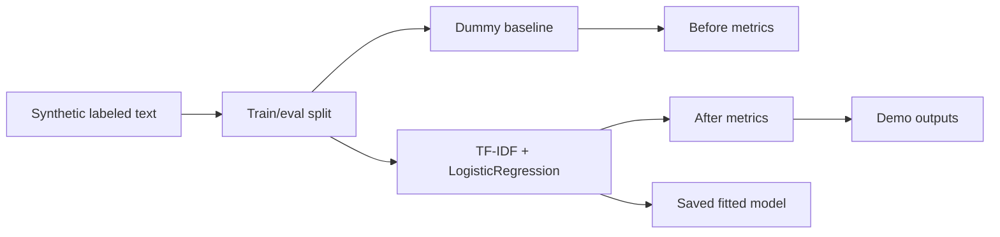

# Real Model Fine-Tune Lab

Small text-classification project that actually fits model weights locally. It trains a TF-IDF + logistic-regression classifier on synthetic portfolio task text, compares it with a dummy baseline, saves a fitted `joblib` model artifact, and writes before/after evaluation metrics.

This project exists alongside the original Fine-Tuning LoRA Lab. The LoRA lab documents adaptation workflow discipline; this lab provides one concrete example where model parameters are really learned and evaluated.

## Problem

Some portfolio projects show mock provider boundaries or simulated fine-tuning workflows. A reviewer also needs at least one small, runnable example where training changes model weights and produces measurable before/after metrics.

## Demo

```bash
streamlit run projects/real-model-finetune-lab/app.py
```

Generate model artifacts:

```bash
python projects/real-model-finetune-lab/evaluate_model.py
```

## Features

- Synthetic but labeled text-classification dataset with fixed train/eval splits.
- Real scikit-learn training using `TfidfVectorizer` and `LogisticRegression`.
- Dummy-classifier baseline for before/after comparison.
- Saved fitted model artifact: `demo_outputs/text_classifier.joblib`.
- Metrics JSON, sample prediction JSON, and model card.
- Tests that confirm the trained model improves over baseline and exposes learned coefficients.

## Tech Stack

Python, scikit-learn, joblib, pandas, Streamlit, pytest.

## Architecture



## Reviewer Signal

Real model fitting, before/after evaluation, saved model artifact handling, lightweight NLP feature extraction, and honest distinction between synthetic data and learned weights.

## Engineering Notes

- The model is intentionally CPU-friendly and fast enough for CI.
- The dataset is synthetic, but the classifier is genuinely fitted and stores learned coefficients.
- The baseline is deliberately weak so the evaluation shows whether training adds measurable signal.
- The project keeps model artifacts local and small enough to inspect.

## Technical Review Discussion Points

- Why a small fitted classifier is more honest than claiming a mock LoRA run updated weights.
- How fixed splits make the before/after metrics repeatable.
- Where the learned parameters live in the logistic-regression coefficients.
- What would be needed to upgrade this into a larger transformer or LoRA experiment.

## Limitations

- Dataset is synthetic and intentionally small.
- This is classical ML, not transformer fine-tuning.
- Metrics demonstrate workflow correctness, not production NLP quality.
- No hosted model registry or production deployment is claimed.
