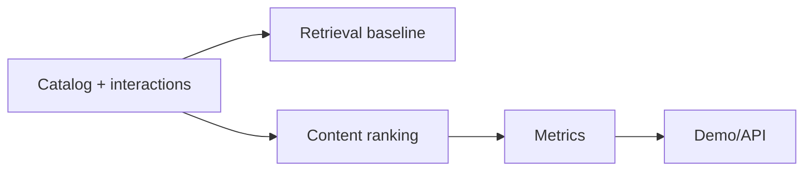

# Recommender System Ranking Engine

Recommendation engine for AI courses/jobs/projects with popularity baseline, content-based ranking, evaluation metrics, API, and demo.

## Problem

Recommendation products need retrieval, ranking, explanations, and metrics, not just a nearest-neighbor call.

## Demo

```bash
streamlit run projects/recommender-system-ranking-engine/app.py
```

## Features

- Synthetic user-item interactions
- Content-based ranking with TF-IDF
- Popularity baseline
- Precision@k and NDCG@k
- FastAPI `/recommend`
- Recommendation explanations through tags and scores

## Tech Stack

Python, pandas, scikit-learn, FastAPI, Streamlit, pytest.

## Architecture



## Limitations

- Small synthetic dataset.
- Collaborative filtering/two-tower models are future extensions.

## How I Would Improve This In Production

- Add matrix factorization, two-tower retrieval, online feedback, and ranking experiments.

## What This Proves To Employers

Recommender systems, embeddings, ranking metrics, applied ML evaluation, and product thinking.

## Engineering Notes

- The engine separates retrieval, ranking, explanation, and metric reporting so each part can be tested and improved independently.
- Synthetic catalog and interaction data make the demo portable while preserving core recommender decisions.
- Ranking metrics are included because recommenders should be judged by list quality, not only individual item similarity.
- Production use would require larger interaction logs, candidate generation, two-tower retrieval, online experiments, feedback loops, and bias monitoring.

## Interview Talking Points

- Explain retrieval versus ranking and why most recommender systems need both.
- Discuss precision@k, NDCG@k, and when each metric is useful.
- Walk through how content-based ranking differs from collaborative filtering.
- Describe how you would run an offline and online evaluation plan.
- Connect the project to user-facing product decisions, not just model similarity.

