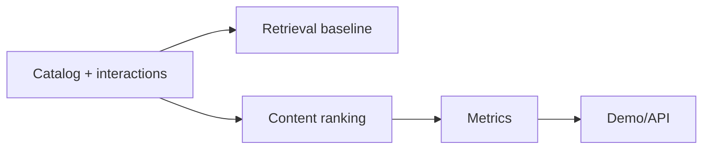

# Content-Based Ranking Baseline

Small ranking baseline for synthetic AI courses, jobs, and projects with popularity comparison, TF-IDF content similarity, evaluation metrics, API, and demo.

## Problem

Recommendation products need retrieval, ranking, explanations, and metrics, not just a nearest-neighbor call.

## Demo

```bash
streamlit run projects/recommender-system-ranking-engine/app.py
```

## Features

- Synthetic user-item interactions
- Content-based ranking with TF-IDF
- Popularity baseline
- Precision@k and NDCG@k
- FastAPI `/recommend`
- Recommendation explanations through tags and scores

## Tech Stack

Python, pandas, scikit-learn, FastAPI, Streamlit, pytest.

## Architecture



## Tests

```bash
python -m pytest tests/test_general_ai_projects.py -k recommender
```

## Limitations

- Small synthetic dataset.
- Collaborative filtering/two-tower models are future extensions.

## Deployment-Relevant Extensions

- Add matrix factorization, two-tower retrieval, online feedback, and ranking experiments.

## Evidence

Popularity comparison, TF-IDF content similarity, precision@k, and NDCG over a small synthetic catalog. No learned embedding or collaborative-ranking model is implied.

## Implementation Notes

- The engine separates retrieval, ranking, explanation, and metric reporting so each part can be tested and improved independently.
- Synthetic catalog and interaction data make the demo portable while preserving core recommender decisions.
- Ranking metrics are included because recommenders should be judged by list quality, not only individual item similarity.
- Production use would require larger interaction logs, candidate generation, two-tower retrieval, online experiments, feedback loops, and bias monitoring.

## Design Decisions

- The code separates retrieval from ranking so both stages and their metrics can be inspected independently.
- Precision@k and NDCG@k are included as list-quality evaluation metrics.
- The project distinguishes content-based ranking from collaborative filtering.
- The roadmap points toward offline and online evaluation planning.
- The recommender is connected to user-facing product decisions, not just model similarity.

