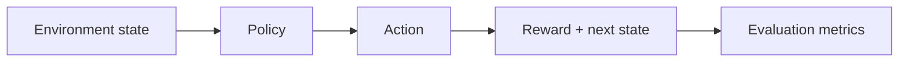

# Reinforcement Learning Portfolio

RL project with warehouse inventory control and dynamic pricing simulators, baseline policies, reward design, and policy evaluation.

## Problem

Sequential decisions such as reordering or price changes require simulation, rewards, baselines, and evaluation before optimization claims are meaningful.

## Demo

```bash
streamlit run projects/reinforcement-learning-portfolio/app.py
```

## Features

- Inventory-control environment
- Dynamic-pricing environment
- Random and heuristic baselines
- Reward curves via local evaluation metrics
- Reproducible seeds
- Short local training/evaluation path

## Tech Stack

Python, NumPy-style environment design, Streamlit, pytest.

## Architecture



## Limitations

- Lightweight custom environments rather than heavy RL libraries.
- No production pricing or inventory claims.

## How I Would Improve This In Production

- Add Gymnasium wrappers, DQN/PPO integrations, experiment tracking, and richer simulations.

## What This Proves To Employers

RL fundamentals, reward shaping, sequential decision-making, simulation, and applied optimization thinking.

## Engineering Notes

- The project focuses on small environments where state, action, reward, and policy behavior can be inspected without heavy dependencies.
- Baseline policies make reward tradeoffs visible before introducing DQN, PPO, or other learned agents.
- The environments are intentionally business-flavored so RL is connected to operational decisions rather than abstract benchmarks only.
- Production use would require Gymnasium-compatible wrappers, experiment tracking, reproducible seeds, stronger baselines, and safety-aware evaluation.

## Technical Review Discussion Points

- Reviewers can inspect the state, action, reward, and transition design for each environment.
- Reward shaping is framed as both a design tool and a source of unintended behavior.
- Baseline policies are included before deep RL to make comparisons meaningful.
- PPO/DQN are documented as future extensions to compare against heuristic policies.
- The project is clearly framed as RL fundamentals, not a production RL deployment.

