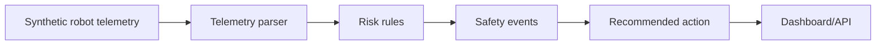

# Site Robot Safety Monitor

Embodied AI safety-monitoring demo that analyzes synthetic construction robot telemetry and flags human proximity, obstacle clearance, restricted-zone speed, payload stability, and emergency-stop events.

## Problem

Construction robots operate near workers, temporary materials, uneven surfaces, and changing site zones. Robotics teams need monitoring systems that translate raw telemetry into safety events and operational actions.

## Why It Matters

Embodied AI is not only model inference. It includes sensing, actuation, physical risk, human-robot interaction, and feedback loops that keep autonomous systems useful and safe.

## Demo

```bash
streamlit run projects/site-robot-safety-monitor/app.py
```

## Features

- Synthetic robot telemetry
- Risk-event classification
- Worker proximity checks
- Obstacle clearance checks
- Restricted-zone speed checks
- Payload stability checks
- Emergency-stop handling
- FastAPI `/safety-events` endpoint

## Tech Stack

Python, pandas, FastAPI, Streamlit, pytest.

## Architecture



## How It Works

The monitor reads robot telemetry rows, applies deterministic safety rules, and returns an explainable event register. This is a local prototype for the kind of monitoring layer that could sit around robot autonomy stacks.

## Example Outputs

```text
Risk: worker_proximity
Severity: high
Evidence: Worker distance 0.74 m while speed was 1.21 m/s.
Action: Reduce speed, increase exclusion buffer, or switch to escorted/manual mode.
```

## Run Locally

```bash
pip install -r requirements.txt
python scripts/generate_sample_data.py
streamlit run projects/site-robot-safety-monitor/app.py
python -m uvicorn site_robot_safety_monitor.api:app --app-dir projects/site-robot-safety-monitor/src --reload
```

## Tests

```bash
pytest tests/test_site_robot_safety.py
```

## Limitations

- Uses synthetic telemetry, not live robots.
- Rules are simplified and do not replace robotics safety standards.
- Does not integrate ROS bags, sensor fusion, SLAM maps, or real-time control loops.

## How I Would Improve This In Production

- Ingest ROS 2 topics, robot logs, and site-zone maps.
- Add perception-derived worker and obstacle tracks.
- Add real-time alerting with human acknowledgement.
- Add incident review dashboards and risk trend analysis.
- Validate thresholds with robotics safety engineers and site teams.

## What This Proves To Employers

- Embodied AI safety thinking
- Human-robot interaction awareness
- Ability to translate telemetry into operational decisions
- Construction robotics specialization beyond generic AI demos

