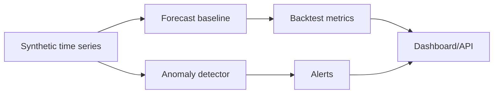

# Time-Series Forecast and Anomaly Baselines

Moving-average forecast and threshold-based anomaly baselines over synthetic API traffic. No learned forecasting model is trained.

## Problem

Operational teams need forecasting and anomaly alerts for traffic, cost, demand, and sensor streams.

## Demo

```bash
streamlit run projects/time-series-anomaly-forecasting/app.py
```

## Features

- Synthetic time-series generator
- Moving-average forecast baseline
- Isolation Forest anomaly detector
- MAE/RMSE/MAPE metrics
- Alert count API
- Streamlit dashboard

## Tech Stack

Python, pandas, NumPy, scikit-learn, FastAPI, Streamlit, pytest.

## Architecture



## Limitations

- Synthetic data only.
- Baseline forecasting rather than full production forecasting stack.

## Deployment-Relevant Extensions

- Add richer backtesting, seasonality models, alert routing, and data-quality monitoring.

## Reviewer Signal

Moving-average forecasting, deterministic anomaly thresholds, synthetic-series generation, and baseline metric packaging. No learned forecaster is implied.

## Engineering Notes

- The project combines forecasting and anomaly detection because operational monitoring usually needs both expected trend and alerting logic.
- Synthetic data keeps the repository lightweight while demonstrating backtesting, thresholds, metrics, and dashboard/API packaging.
- The baseline is intentionally interpretable so alert behavior can be explained before adding heavier forecasting models.
- Production use would require richer seasonality handling, data-quality checks, alert routing, incident feedback, and model monitoring over time.

## Technical Review Discussion Points

- Reviewers can distinguish forecasting error from anomaly detection.
- Threshold calibration is presented as the main control for noisy alerts.
- Backtesting and time-aware splits are part of the evaluation story.
- The project identifies when statistical baselines, tree models, or deep forecasting models may be appropriate.
- The workflow connects to monitoring use cases in operations, energy, finance, and infrastructure.

