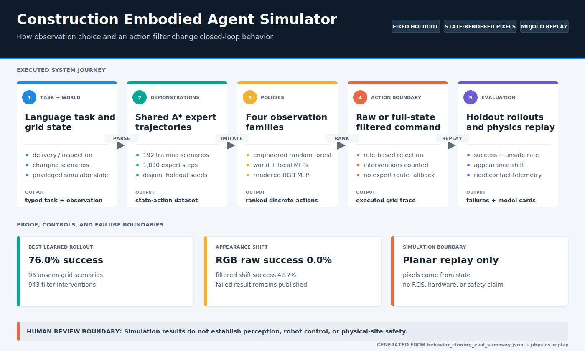

# Construction Embodied Agent Architecture

## System Boundary

The system accepts a natural-language task and structured grid state, then emits discrete simulator actions. It does not accept physical sensor streams or command hardware. Two learned policies receive only a local agent-centered crop plus relative subgoal geometry: one receives semantic channels and one receives rendered RGB pixels. Both observations still originate from privileged simulator state rather than a perception subsystem. A separate MuJoCo adapter replays a fixed subset of movement commands as continuous planar motion; it does not feed physics state back into policy training or task evaluation.

## Components

| Component | Responsibility | Evidence boundary |
| --- | --- | --- |
| Task parser | Maps delivery, inspection, and charging phrases into `TaskSpec`. | Deterministic rules, not language-model reasoning. |
| Grid environment | Applies movement, task, reward, battery, and terminal transitions. | 2D discrete state machine, not physics. |
| Safety checks | Reject bounds, obstacle, restricted-zone, worker-zone, and battery violations. | Hand-authored simulator rules. |
| A* expert | Produces demonstrations and deterministic planning-reference episodes. | Full map access; not learned. |
| Engineered-state encoder | Produces 24 task, geometry, battery, safety, and distance features. | Privileged structured state. |
| Semantic-raster encoder | Produces eight 7x7 binary state channels and six global values. | Privileged structured state; no pixels or perception. |
| Egocentric encoder | Produces eight agent-centered 5x5 channels plus ten task/navigation values. | Off-window hazards hidden from classifier; relative subgoal retained. |
| Synthetic RGB renderer | Converts the same local 5x5 crop into a 10x10 RGB image using deterministic categorical palettes. | Pixels are state-rendered, not camera-captured; no detection, depth, calibration, or realistic sensor model. |
| Random-forest policy | Fits actions from engineered-state demonstrations. | Classical supervised imitation baseline. |
| World-raster MLP | Standardizes and classifies flattened full-grid semantic features. | One 64-unit hidden layer; no convolution, attention, or recurrence. |
| Egocentric MLP | Standardizes and classifies the local semantic window and global values. | One 64-unit hidden layer; no temporal memory or uncertainty output. |
| Synthetic RGB MLP | Standardizes 300 pixel values plus ten task/navigation values and classifies actions. | One 64-unit hidden layer; no convolution or visual foundation model. |
| Action filter | Re-ranks actions after rejecting unsafe or task-invalid choices using full simulator rules. | Can see hazards hidden from the egocentric classifier; no expert task route or completion guarantee. |
| Evaluator | Measures expert-state classification and closed-loop holdout behavior. | Fixed-seed local regression protocol. |
| MuJoCo replay model | Maps grid cells to meter-scale targets, drives a cylindrical body with two slide joints, and records named rigid contacts and target error. | Planar command-boundary regression only; no mobile-base kinematics, realistic controller, perception, ROS, or safety validation. |

## Training And Evaluation Flow

The map is generated from the current holdout and physics-replay evidence. All learned families share demonstrations and scenario splits; raw and filtered results remain separate, and the MuJoCo command replay is downstream evidence rather than a coupled training environment.

## Runtime Flow

1. Parse the instruction into a task type, subgoal, and terminal action.
2. Encode current state as engineered features, a world-frame semantic raster, an agent-centered semantic window, or rendered agent-centered RGB pixels plus globals.
3. Rank action classes by classifier probability.
4. In raw mode, execute the top-ranked action.
5. In filtered mode, select the highest-ranked action that passes movement and task-context checks. Battery-reserve recovery may route only to a charger.
6. Record transitions and interventions.
7. Stop on completion or the scenario action limit.
8. For the fixed physics subset, replay recorded movement targets in MuJoCo and keep physics metrics separate from discrete task metrics.

## Design Decisions

- All four learned policy families share demonstrations and holdout scenarios so the representation comparison is controlled.
- The random forest is a compact CPU baseline for engineered features.
- The world-raster MLP deliberately consumes a flattened grid. Its poor result provides a baseline for spatially aligned observations and a future convolutional encoder.
- The egocentric MLP hides hazards outside a 5x5 window while retaining relative subgoal geometry. Its improvement isolates observation alignment, but its filter still uses privileged full-state rules.
- The RGB MLP receives pixels rather than semantic channels. Two training palettes provide bounded appearance variation; an unseen work-light palette is evaluated separately and exposes substantial brittleness.
- A mean-pixel ablation retains the ten telemetry values while replacing every pixel with its training-set mean; the resulting accuracy drop tests whether the image contributes predictive information.
- Closed-loop evaluation sits beside action accuracy because imitation errors shift later states.
- A* remains separate from learned policies and is never used for task-goal fallback.
- MuJoCo receives already-generated movement commands. Failed commands return to the discrete result cell before the next replay step, which preserves comparison alignment but is not a recovery controller.
- Generated model binaries are ignored; deterministic metrics, cards, reports, and diagrams are versioned.
